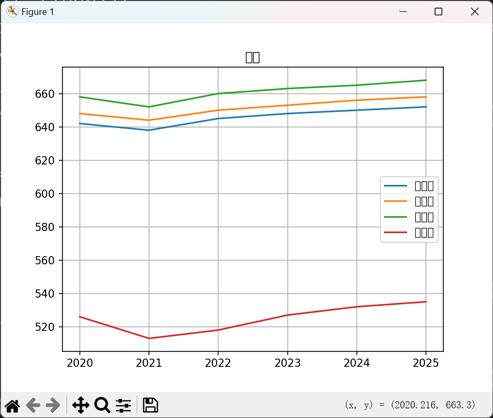
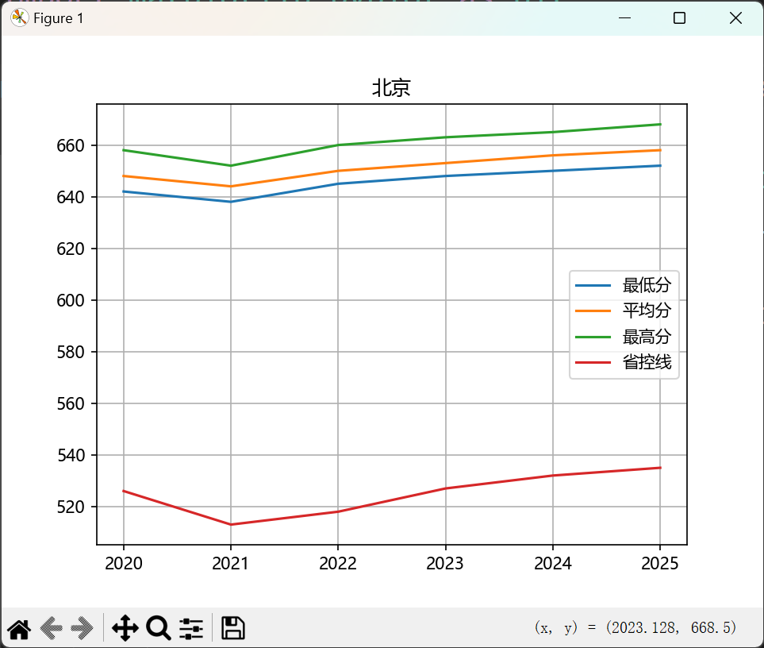
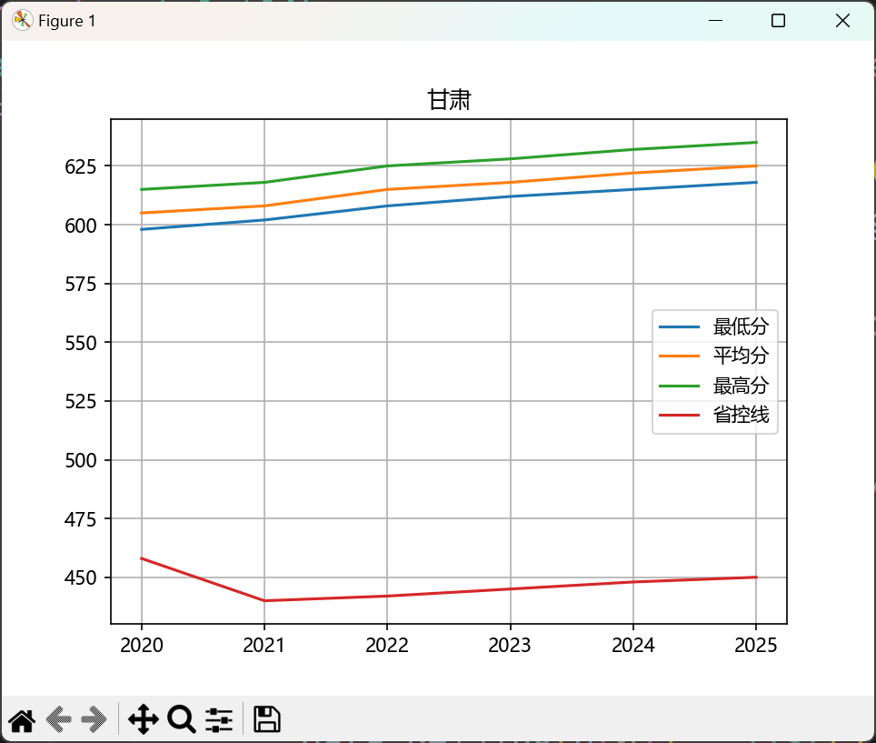

# 实验目的
使用Python，根据提供的网页信息，用正则表达式提取其中的省份、年份、分数线，并画出两个省份，不同分数线随年份的变化趋势图。
# 实验设置
1. 实验环境
Windows 11
Python 3.13.2
Visual Studio Code
2. 实验数据
chenji.html
# 实验方法
1. 方法思路
先使用 Visual Studio Code 打开 html 文件查看分数线数据形式：
```html
            <tbody>
                <!-- 北京数据 -->
                <tr>
                    <td>2020</td>
                    <td>北京</td>
                    <td>642</td>
                    <td>648</td>
                    <td>658</td>
                    <td>526</td>
                    <td>116</td>
                </tr>
                <tr>
                    <td>2025</td>
                    <td>甘肃</td>
                    <td>618</td>
                    <td>625</td>
                    <td>635</td>
                    <td>450</td>
                    <td>168</td>
                </tr>
                ...
            </tbody>
```
发现数据存储较为规律，可以使用以下正则表达式爬取：
```
<tr>\s*<td>\d\d\d\d</td>\s*<td>\w\w</td>\s*<td>\d\d\d</td>\s*<td>\d\d\d</td>\s*<td>\d\d\d</td>\s*<td>\d\d\d</td>\s*<td>\d\d\d</td>\s*</tr>
```
查询相关资料，编写代码

2. 实验代码
```python
import re
import matplotlib.pyplot as plt
import matplotlib
matplotlib.rc("font", family='Microsoft YaHei')
if __name__ == '__main__':
    data_Beijing, data_Gansu = dict(), dict()
    with open('./chenji.html', 'r', encoding = 'utf-8') as f:
        data = re.findall(
            '<tr>\s*<td>\d\d\d\d</td>\s*<td>\w\w</td>\s*<td>\d\d\d</td>\s*<td>\d\d\d</td>\s*<td>\d\d\d</td>\s*<td>\d\d\d</td>\s*<td>\d\d\d</td>\s*</tr>',
            f.read())
        for d in data:
            for i in [' ', '\n', '<tr>', '</tr>', '<td>']:
                d = d.replace((i ), '')
            d = d.split('</td>')
            d[0] = int(d[0])
            if d[1] == '北京':
                data_Beijing[d[0]] = list()
                data_Beijing[d[0]].extend(int(d[i].strip()) for i in [2, 3, 4, 5, 6])
            else:
                data_Gansu[d[0]] = list()
                data_Gansu[d[0]].extend(int(d[i].strip()) for i in [2, 3, 4, 5, 6])
    s = ['最低分', '平均分', '最高分', '省控线']
    for i in range(4):
        x, y = list(), list()
        for k, v in data_Beijing.items():
            x.append(k)
            y.append(v[i])
        plt.plot(x, y, label = s[i])
    plt.legend()
    plt.title('北京')
    plt.grid(True)
    plt.show()
    for i in range(4):
        x, y = list(), list()
        for k, v in data_Gansu.items():
            x.append(k)
            y.append(v[i])
        plt.plot(x, y, label = s[i])
    plt.legend()
    plt.title('甘肃')
    plt.grid(True)
    plt.show()
```
# 实验过程
编写代码时出现在plt界面添加中文标题时出现乱码的问题：



终端报错```Glyph 22343 (\N{CJK UNIFIED IDEOGRAPH-5747}) missing from font(s) DejaVu Sans.```

通过搜索引擎找到[解决方案](https://blog.csdn.net/kuwola/article/details/122409200)，在实验代码中加入以下代码即可：
```python
import matplotlib
matplotlib.rc("font", family='Microsoft YaHei')
```

# 实验结论
提取出的成绩信息：
```python
{2020: [642, 648, 658, 526, 116], 2021: [638, 644, 652, 513, 125], 2022: [645, 650, 660, 518, 127], 2023: [648, 653, 663, 527, 121], 2024: [650, 656, 665, 532, 118], 2025: [652, 658, 668, 535, 117]}
{2020: [598, 605, 615, 458, 140], 2021: [602, 608, 618, 440, 162], 2022: [608, 615, 625, 442, 166], 2023: [612, 618, 628, 445, 167], 2024: [615, 622, 632, 448, 167], 2025: [618, 625, 635, 450, 168]}
```
画出的不同图片：





# 自己的思考
通过本次实验，我深刻理解了正则表达式在数据提取中的强大作用，同时也认识到数据可视化对分析趋势的重要性。