# 互联网舆情发现系统

## 实验目的

本实验旨在通过爬取主流社交平台（如微博、知乎、小红书等）的文本数据，结合关键词匹配与情感分析等方法，识别涉政有害、侮辱谩骂、色情暴力、事故灾难、聚集维权、娱乐八卦等六类负面舆情内容，并进行统计分析与可视化展示，提升对网络舆情的监测与预警能力。

## 实验设置

### 实验环境

- Windows 11
- Python 3.13.2
- PyCharm

### 实验数据

- 微博爬取的各种数据
  - 特定话题：近期热点关键词
  - 特定用户：北京邮电大学官微


## 实验方法

### 方法思路

- 特定主题的爬取
  - 微博搜索主题所用的 URL 中包含了 page 参数，且页面整体为静态页面，一次性能爬取一整页约 20 条帖子，只需要模拟点击展开和评论按钮
- 特定用户的爬取
  - 微博用户界面是动态展示页面，需要不断下滑才能爬取新的内容，故使用 `Selenium` 库模拟点击展开和评论按钮并进行下滑
- 数据的存储
  - 数据量不大，故选用 `TinyDB` 作为数据库，该数据库使用 json 结构存储数据
- 数据的分析
  - 使用 `jieba` 对文本进行分词后直接对关键词进行匹配得到比例
  - 使用 `matplotlib` 对结果进行可视化

### 实验代码

篇幅限制，仅展示关键部分代码

- 模拟点击展开按钮并获取帖子内容

  - ```python
    expand_button = item.find_elements(By.XPATH, './/a[@action-type="fl_unfold"]')
    if len(expand_button) > 0:
        click(driver, expand_button[0])
        content = item.find_elements(By.XPATH, './/p[@node-type="feed_list_content"]')
        content_full = item.find_elements(By.XPATH, './/p[@node-type="feed_list_content_full"]')
        if len(content_full) > 0:
            result["content"] = content_full[0].text.rstrip("收起d")
        else:
            result["content"] = content[0].text
            result["comments"] = list()
    ```

- 模拟点击评论按钮并获取评论内容

  - ```python
    comment_button = item.find_elements(By.XPATH, ".//i[@title='评论']")
    driver.execute_script("arguments[0].click();", comment_button[-1])
    if not DEBUG:
        time.sleep(1 + random.random())
        comments = item.find_elements(By.XPATH, ".//div[@class='wbpro-list']")
        result["comment"] = list()
        for comment in comments:
            comment.find_elements(By.XPATH, ".//div[@class='text']")
            comment = comment.text.split("来自")
            result["comment"].append({"comment": comment[0], "responses_to_comment": comment[1:-1]})
    ```

- 调用数据库并存储数据

  - ```python
    def save(db, results):
        for k, v in results.items():
            db.insert({"index": k, "data": v})
    ```

- 分析结果并画图

  - ```python
    def plot(ax, x_data, y_data, title, xlabel, ylabel):
        ax.bar(x_data, y_data)
        ax.set_title(title)
        ax.set_xlabel(xlabel)
        ax.set_ylabel(ylabel)
        ax.set_ylim(0,100)
    ```

  - ```python
    fig, axes = plt.subplots(1, len(topics) + 1, figsize = (5 * (len(topics) + 1), 5))
    axes = axes.ravel()
    axes_iter = iter(axes)
    for topic in topics:
        x, y = list(), list()
        for i, item in enumerate(topic_results[topic]):
            x.append(f"{wordbank_topics[i]}\n{item[wordbank_topics[i]]}%")
            y.append(item[wordbank_topics[i]])
            plot(next(axes_iter), x, y, topic, "关键词", "比例")
            x, y = list(), list()
            for k, v in user_results.items():
                x.append(f"{k}\n{v}%")
                y.append(v)
                plot(next(axes_iter), x, y, "用户", "关键词", "比例")
                plt.tight_layout()
                plt.show()
                plt.savefig("result.png", dpi=500)
    ```


## 实验过程

- 先使用 `bs4` 和 `requests` 尝试爬取特定主题内容

- 网页版微博登陆后搜索 `特朗普` 发现对应网页为 `https://s.weibo.com/weibo?q=%E7%89%B9%E6%9C%97%E6%99%AE`

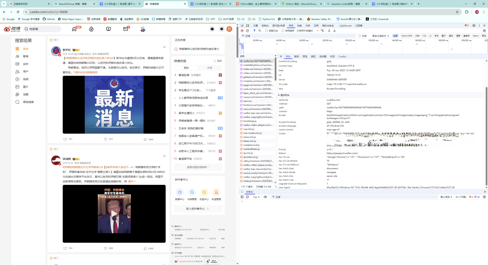

- 观察网页源代码

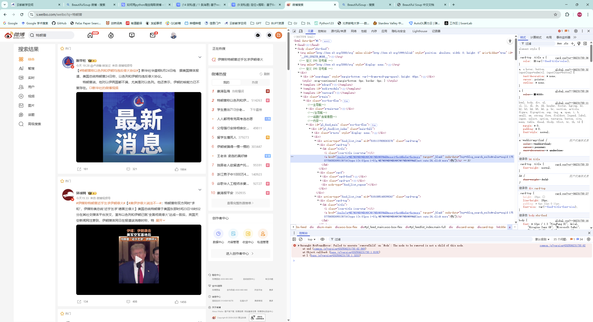

- 通过 `soup.find_all("div", class_= "card")` 爬取其结构并观察

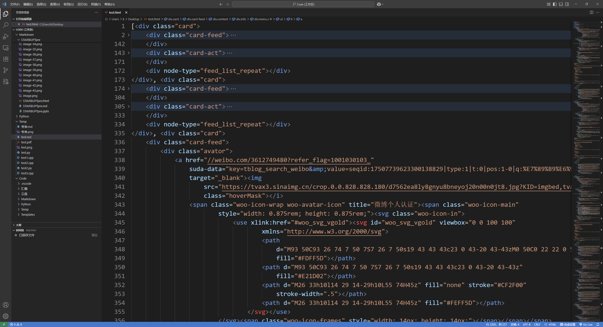

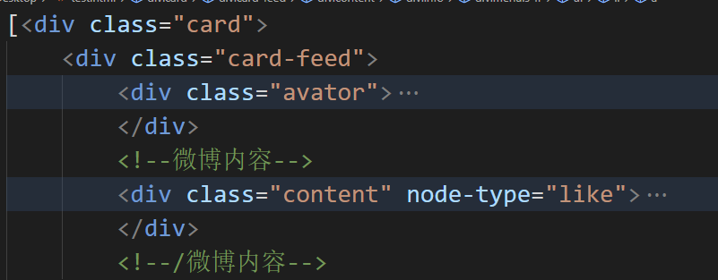


- 通过 `soup.find_all("p", {"class": "txt"})` 爬取内容，发现部分正文被折叠

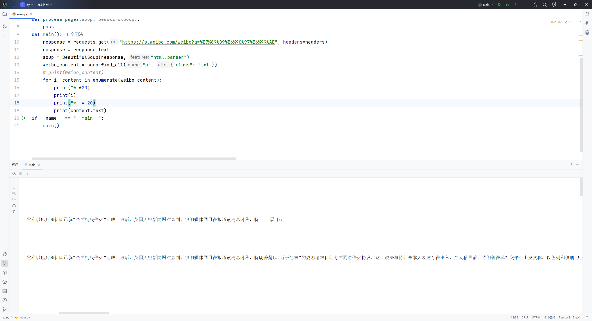

- 通过浏览器发现有展开按钮


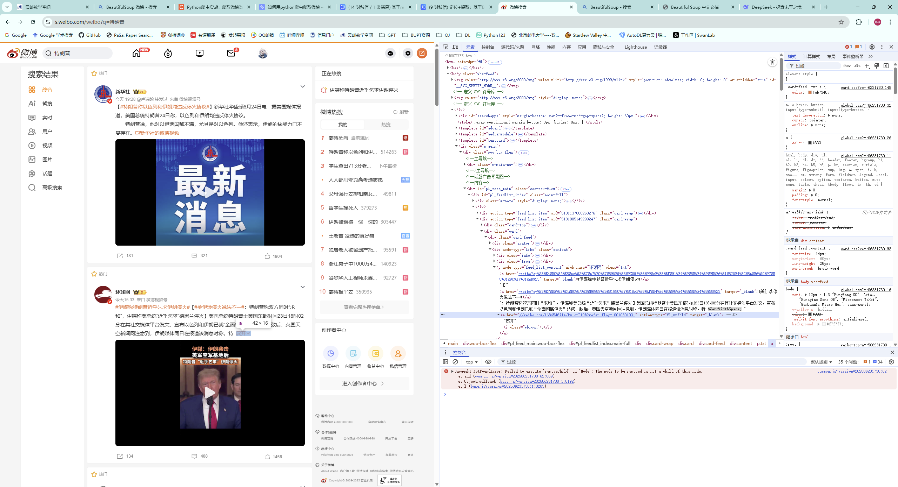

- 故重构代码，使用 `Selenium` 模拟点击

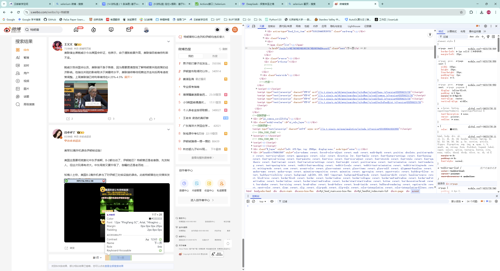

- 定位展开评论按钮

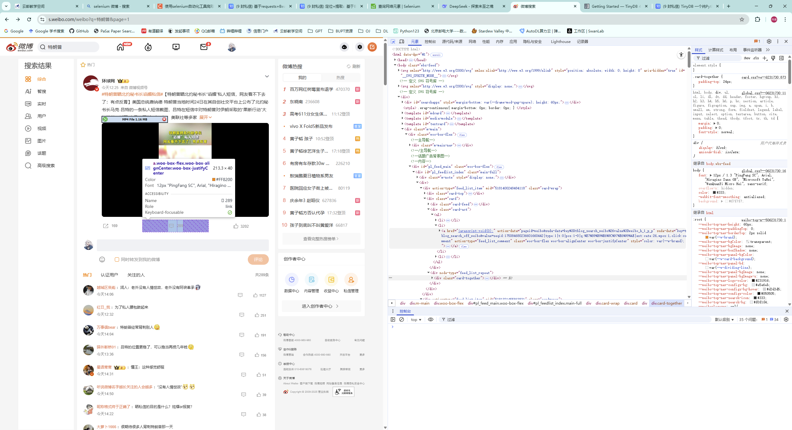

- 定位评论内容

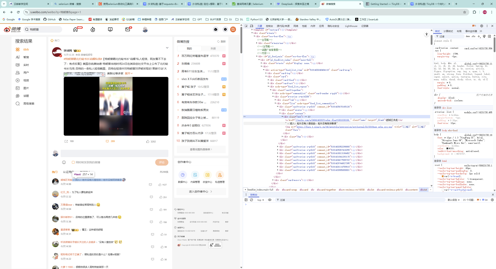

- 特定用户内容的爬取同理

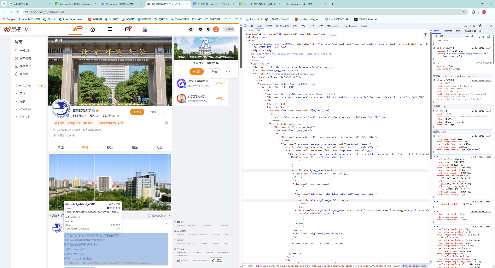

- 对爬取的结果进行分析

## 遇到的问题与解决方案

- 在数据库存储结果时出现 `UnicodeEncodeError: 'gbk' codec can't encode character '\U0001f53b' in position 2214: illegal multibyte sequence`
  - 初始化数据库时传入特定参数解决编码问题 `db = TinyDB('topic.json', ensure_ascii = False, encoding ='utf-8')`

- 保存的 cookies 无法再次登陆，刚开始编写时能够成功通过 cookies 登陆，debug 时多次重复登陆，疑似触发微博机制
  - 使用手动登陆

- 爬取搜索结果时模拟点击展开/评论按钮有极小概率会进入新的页面
  - 通过 `driver.current_window_handle` 获取搜索页面句柄，在点击操作后切换回原页面

- 爬取搜索结果时遇到转发其他帖子的帖子会出现识别评论按钮错误的情况
  
  - 选择最后一个按钮进行点击
  
  - ```python
    comment_button = item.find_elements(By.XPATH, ".//i[@title='评论']")
    driver.execute_script("arguments[0].click();", comment_button[-1])
    ```
  
- 爬取用户帖子时只能爬取翻页到底后一页的内容，通过浏览器浏览发现微博的用户页面是动态展示的，往下翻页时上面的内容会被替换掉
  - 一边翻页一边爬取

- 爬取用户帖子时得到的数据顺序混乱
  - 分析得到帖子序号并进行排序

- 爬取用户帖子超过 12 个后出现序号与帖子顺序不符

  - 重构代码，选择帖子的 `herf` 作为序号

  

## 实验结论

### 画出的不同图片

- 特定话题的比例

  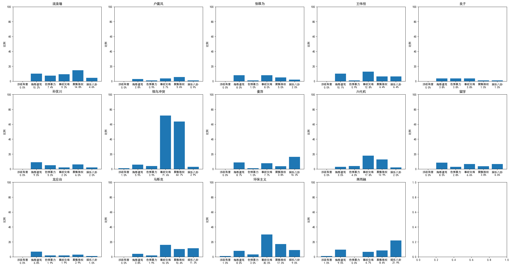

- 特定用户（北京邮电大学微博账号）的比例

  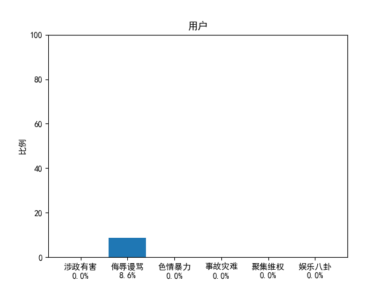

### 结论

- 不同话题的舆情不同，部分话题（如俄乌冲突）下文本中含特定关键词（如事故灾难）较多
- 北京邮电大学的微博账号舆情较为稳定平和

## 自己的思考与收获

- 爬虫是双刃剑
- 舆情无处不在
- 要学会利用搜索引擎和大模型解决遇到的问题
- Python 有各种灵活的库
