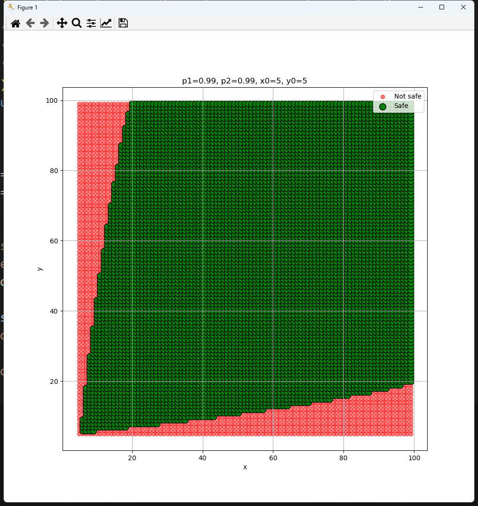
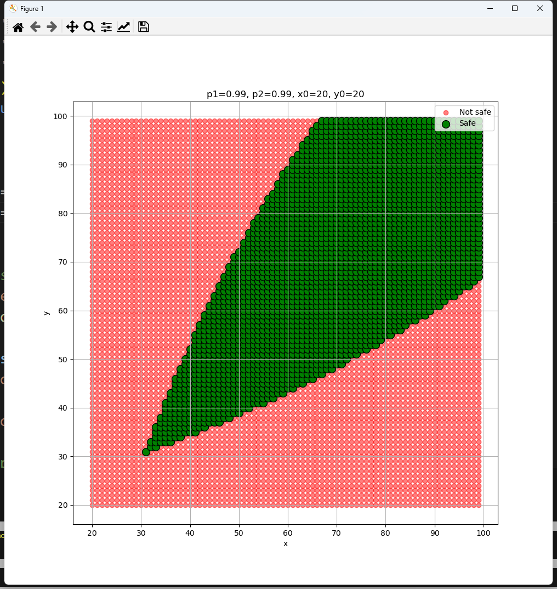
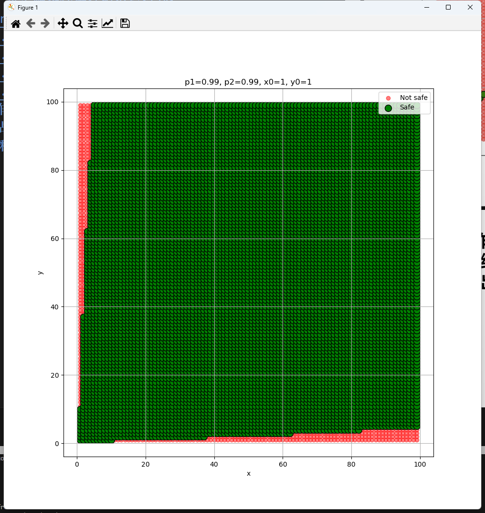
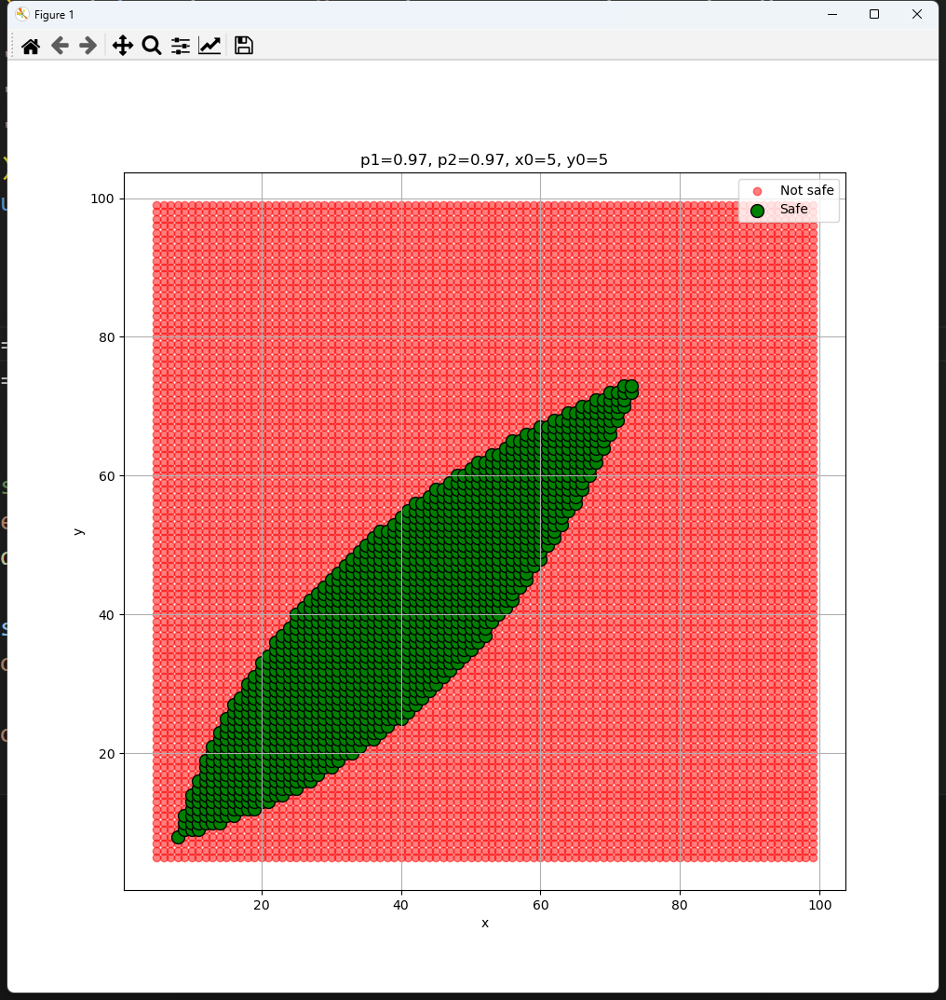
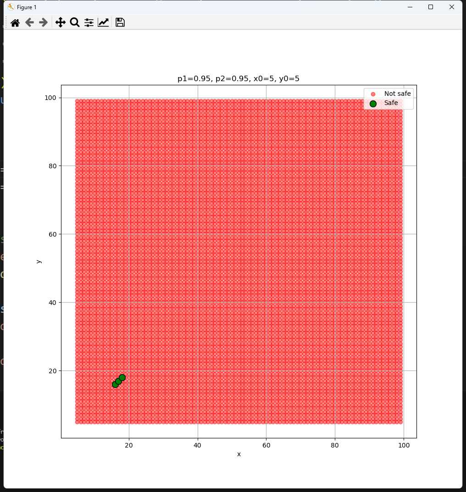
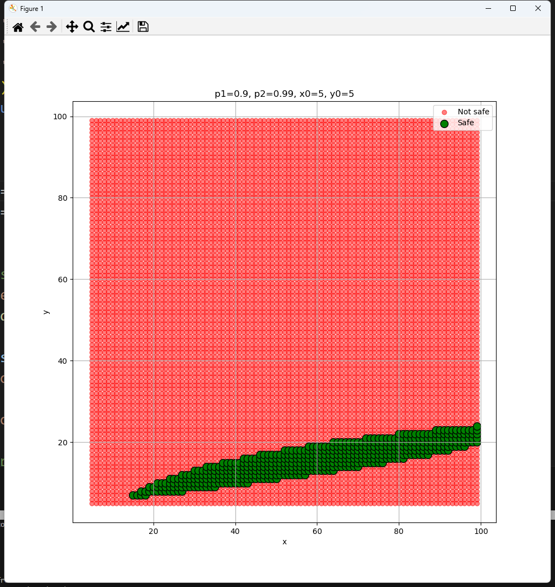
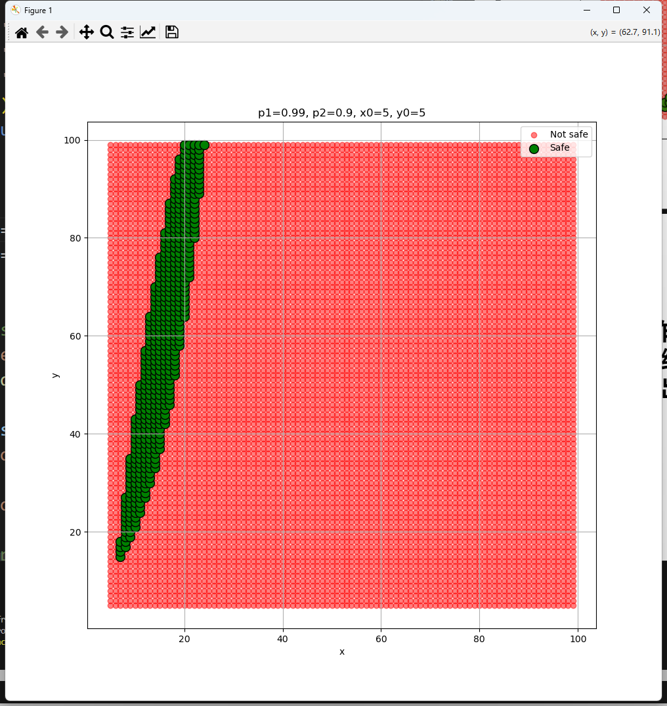

# 推论甲乙双方的无差别曲线以及双方安全区域的存在性
### $$\sum_{k=x_0}^{x} C_x^k \cdot p_1^{k \cdot y} \cdot (1 - p_1^y)^{(x-k)} \geq 0.9, \quad \sum_{k=y_0}^{y} C_y^k \cdot p_2^{k \cdot x} \cdot (1 - p_2^x)^{(y-k)} \geq 0.9$$
### 使用 Python 对定解条件进行模拟后得到：
### 
### 增大 $x_0, y_0$
### $x_0, y_0$ 的增大使得方程的求和较原情况变小了
### 故安全区外扩，xy 无差别曲线远离 xy 轴
### 
### 减小 $x_0, y_0$
### $x_0, y_0$ 的减少使得方程的求和较原情况变大了
### 故安全区内收，xy 无差别曲线靠近 xy 轴
### 
### 减小 $p_1, p_2$
### 双方所需要的核弹数量较原情况变少了
### 故安全区外扩，xy 无差别曲线远离 xy 轴
### 
### 
### 减小 $p_1$
### x 不变时 y 所需要的核弹数量较原情况变少了
### 故安全区向 x 轴靠近
### 
### 减小 $p_2$
### 情况与上类似
### 故安全区向 y 轴靠近
### 
# 1）独立对混合作战形式进行类似的讨论；2）并对多种作战形式下相关参与方综合作战实力的评估模型，结合柯布-道格拉斯函数的形式，给出统一性解释。
- ## 独立对混合作战形式进行类似的讨论
  ### $\begin{cases} \dot{x} = -c \cdot x \cdot y \\ \dot{y} = -b \cdot x \\ x(0) = x_0, \ y(0) = y_0 \end{cases}$
  ### 该方程表示甲方为游击部队，乙方为正规部队
  ### $\frac{dy}{dx} = \frac{dy}{dt} \cdot \frac{dt}{dx} = \frac{-bx}{-cxy} = \frac{b}{cy}$
  ### $cy \ dy = b \ dx$
  ### $\frac{c}{2}y^2 = bx + k$
  ### 即 $x = \frac{c}{2b}y^2 - \frac{k}{b}$
  ### 在图像中为二次函数
  ### 令 $k = \frac{c}{2}y^2-bx$
  ### $k=0$ 时双方平局
  ### $k<0$ 时甲方胜利
  ### $k>0$ 时乙方胜利
- ## 并对多种作战形式下相关参与方综合作战实力的评估模型，结合柯布-道格拉斯函数的形式，给出统一性解释
  ### 柯布-道格拉斯函数 $P = AL^\alpha K^\beta $
  ### P 为产出，A 为技术系数，L 为劳动，K 为资本，$\alpha, \beta$ 为弹性指数
  ### 令 $k$ 为胜利指标
  ### $k=0$ 时双方平局
  ### $k<0$ 时甲方胜利
  ### $k>0$ 时乙方胜利
  ### 纯正规作战 $k = ay^2 - bx^2$
  ### 纯游击作战 $k = cy - dx$
  ### 混合作战 $k = \frac{c}{2}y^2-bx$
  ### 类比到战争模型上：
  ### 纯正规作战中 $ay^2$ 为乙方战争效能，$bx^2$ 为甲方战争效能
  ### $a, b$ 为战术系数，$x, y$ 为兵力，甲乙双方的弹性指数均为 2
  ### 纯游击作战中 $cy$ 为乙方战争效能，$dx$ 为甲方战争效能
  ### $c, d$ 为战术系数，$x, y$ 为兵力，甲乙双方的弹性指数均为 1
  ### 混合作战中 $\frac{c}{2}y^2$ 为乙方战争效能，$bx$ 为甲方战争效能
  ### $a, b$ 为战术系数，$x, y$ 为兵力，甲方的弹性指数为 1，乙方的弹性指数为 2