# 实验环境
- Windows 11 系统
- MySQL 9.2
- DBeaver 25.0.2
# 实验内容与完成情况
- 数据库设计（学生选课）
  - 学生表 Students
    - student_id(primary key)(INT)
    - name(VARCHAR)
    - email(VARCHAR)
  - 教师表 Teachers
    - teacher_id(primary key)(INT)
    - name(VARCHAR)
    - email(VARCHAR)
  - 课程表 Courses
    - course_id(primary key)(INT)
    - name(VARCHAR)
    - description(VARCHAR)
    - teacher_id(foreign key)
  - 选课表 Enrollments
    - student_id(primary key)(foreign key)
    - course_id(primary key)(foreign key)
    - grade(FLOAT)
- 数据定义
  - 表的创建
    1. 连接到 MySQL 后右键数据库，创建 test_school 数据库
    2. 右键 test_school 数据库，依次创建上述四个表
    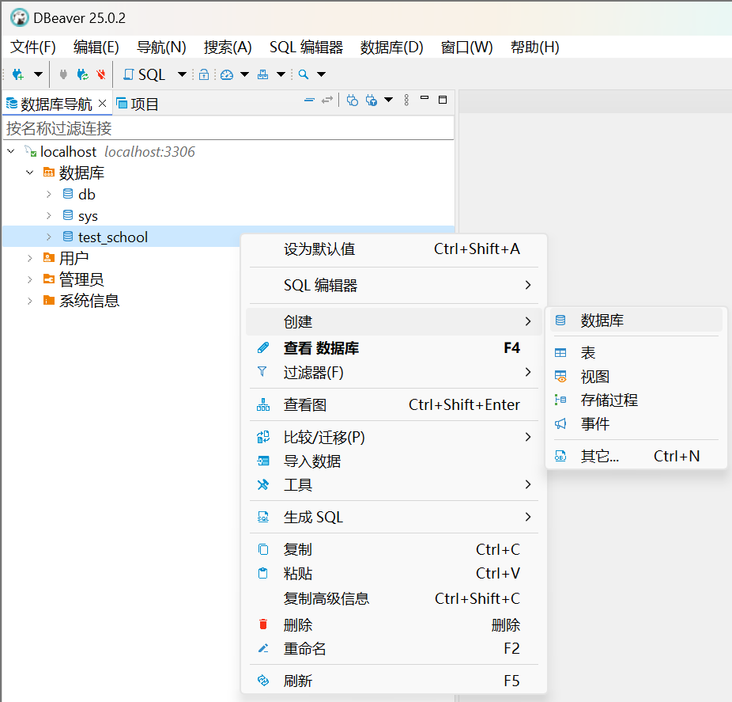
    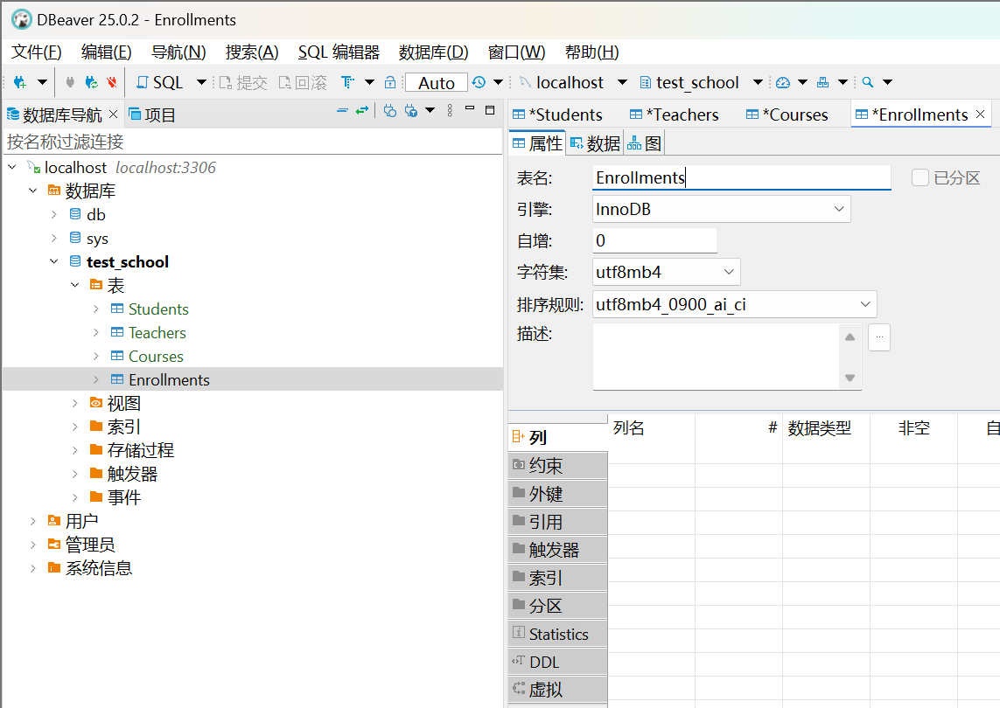
    3. 依次右键四个表，创建列
    
  
    4. 设置 Courses 表和 Enrollments 表的外键
    
    5. 设置 Enrollments 表的约束
    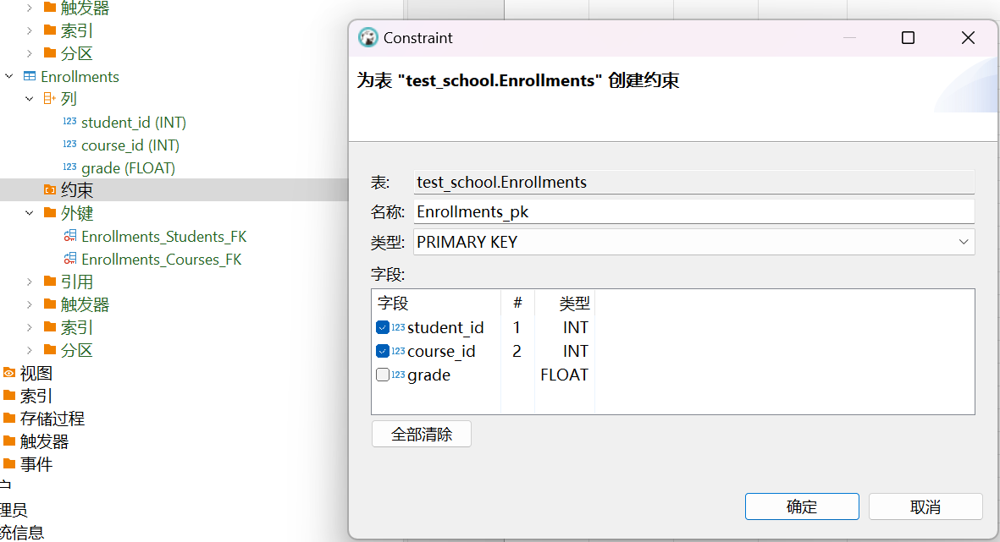
  - 表的修改
    双击 Students 表的 student_id 列的自增选项`[]`，成功设置自增属性
    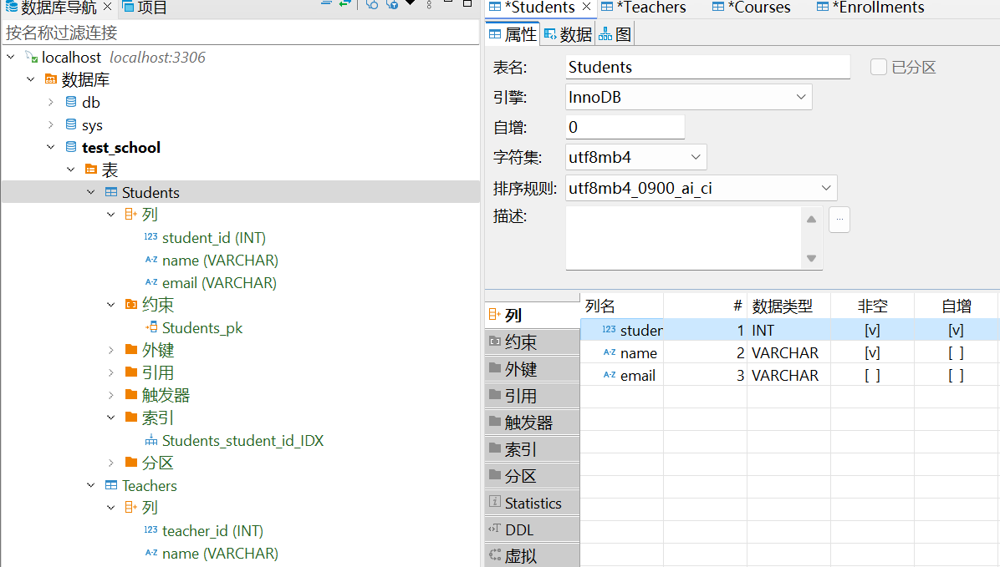
  - 表的删除
    右键表即可删除表
    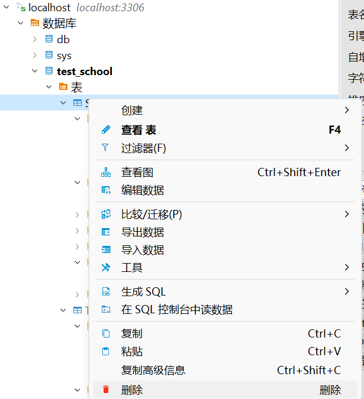
  - 索引的创建
    创建主键索引
    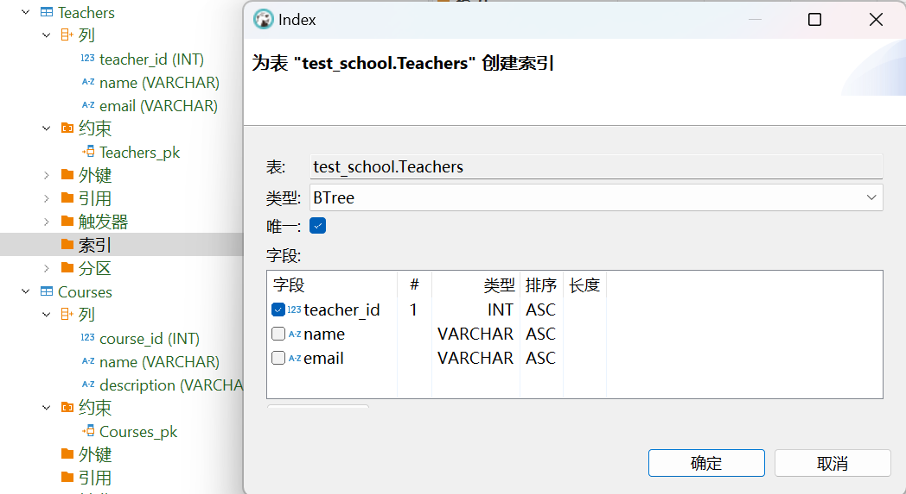
  - 索引的删除
    右键索引即可删除索引
    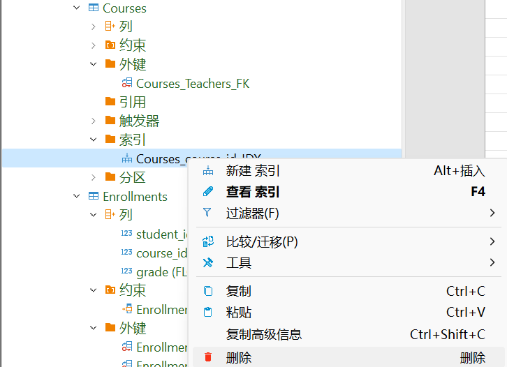
- 数据操作
  - 插入数据
    点击 SQL 按钮，输入对应语句进行插入
    ```sql
    INSERT INTO Students (student_id, name, email) VALUES 
    (1, '张三', 'zhangsan@example.com'),
    (2, '李四', 'lisi@example.com');
    INSERT INTO Teachers (teacher_id, name, email) VALUES 
    (101, '王老师', 'wanglaoshi@example.com'),
    (102, '赵老师', 'zhaolaoshi@example.com');
    ```
    ```sql
    INSERT INTO Courses (course_id, name, description, teacher_id) VALUES 
    (201, '数据库原理', '介绍数据库的基本概念与SQL语言', 101),
    (202, '操作系统', '讲解操作系统的工作原理与机制', 102);
    INSERT INTO Enrollments (student_id, course_id, grade) VALUES 
    (1, 201, 88.5),
    (2, 202, 92.0);
    ```
    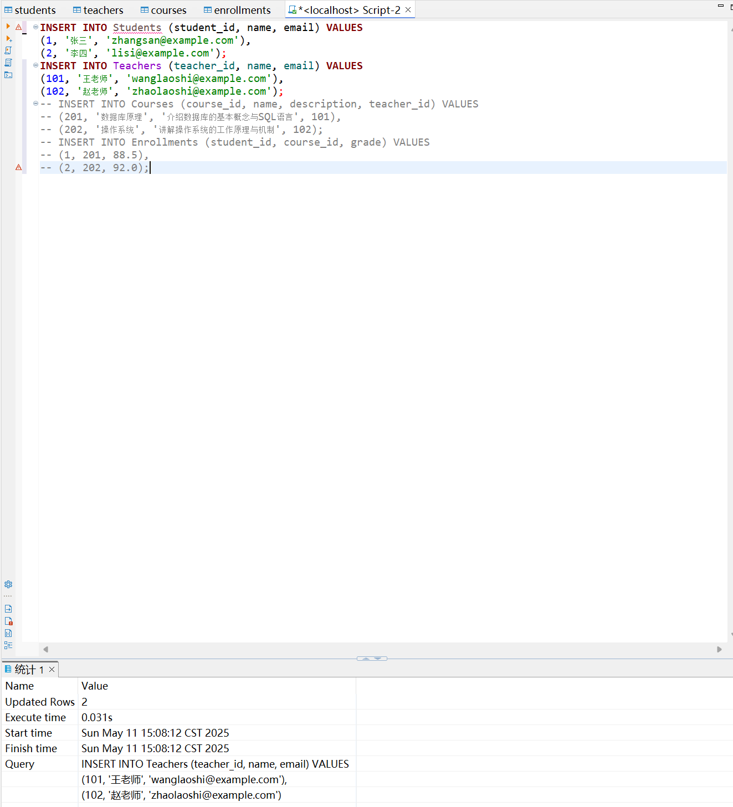
  - 修改数据
    修改学号为 1 的学生的邮箱
    ```sql
    UPDATE Students
    SET email = 'test@example.com'
    WHERE student_id = 1;
    ```
    
  - 删除数据
    删除学号为 2 的学生的选课记录
    ```sql
    DELETE FROM Enrollments
    WHERE student_id = 2
    ```
  - 单表查询
    查询所有教师的名字与邮箱
    ```sql
    SELECT name, email
    FROM Teachers;
    ```
    
  - 连接查询
    1. 查询每个学生的姓名及其所选课程名称和成绩
    ```sql
    SELECT S.name AS student_name, C.name AS course_name, E.grade
    FROM Students S
    JOIN Enrollments E ON S.student_id = E.student_id
    JOIN Courses C ON E.course_id = C.course_id;
    ```
    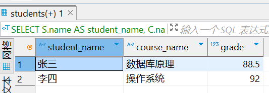
    2. 查询每门课程的名称及其授课教师的姓名
    ```sql
    SELECT C.name AS course_name, T.name AS teacher_name
    FROM Courses C
    JOIN Teachers T ON C.teacher_id = T.teacher_id;
    ```
    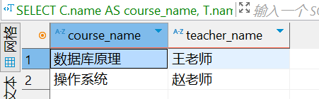
  - 嵌套查询
    1. 查询没有选修任何课程的学生
    ```sql
    INSERT INTO Students
    (student_id, name, email)
    VALUES(3, '王五', 'ww@example.com');
    SELECT *
    FROM Students
    WHERE student_id NOT IN (
        SELECT DISTINCT student_id FROM Enrollments
    );
    ```
    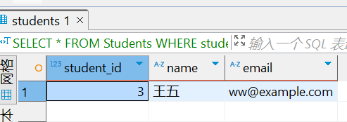
    2. 查询选修了数据库原理这门课程的所有学生的姓名
    ```sql
    SELECT S.name 
    FROM Students S
    WHERE S.student_id IN (
        SELECT E.student_id 
        FROM Enrollments E 
        JOIN Courses C ON E.course_id = C.course_id 
        WHERE C.name = '数据库原理'
    );
    ```
    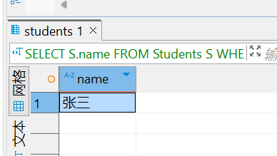
  - 集合查询
    查询选修了数据库原理或者操作系统课程的所有学生姓名
    ```sql
    SELECT S.name 
    FROM Students S
    JOIN Enrollments E ON S.student_id = E.student_id
    JOIN Courses C ON E.course_id = C.course_id
    WHERE C.name = '数据库原理'

    UNION

    SELECT S.name 
    FROM Students S
    JOIN Enrollments E ON S.student_id = E.student_id
    JOIN Courses C ON E.course_id = C.course_id
    WHERE C.name = '操作系统';
    ```
    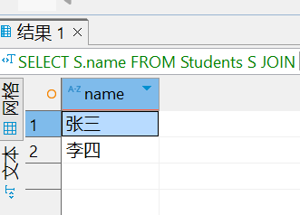
# 出现的问题及解决方案
- 连接 MySQL 时报错 `Public Key Retrieval is not allowed`
  - 在连接设置中将`allowPublicKeyRetrieval`设置为true
  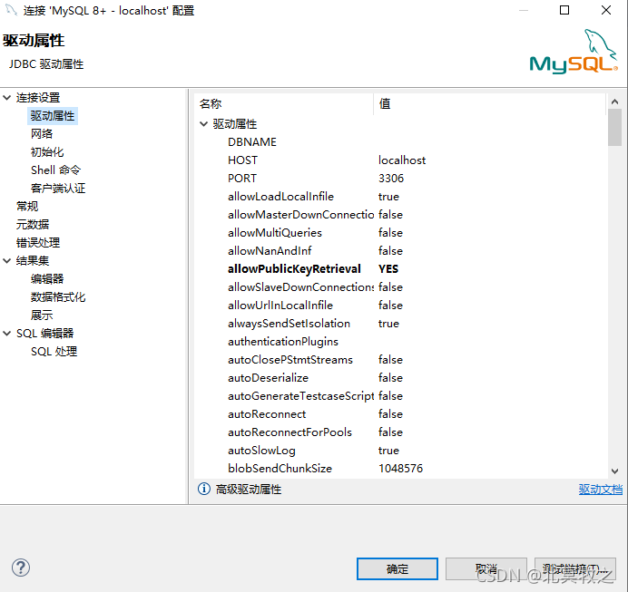
- 插入数据时报错表不存在
  - 在四个表中点击下方保存按钮
- 插入数据时第四个表报错 ```Cannot add or update a child row: a foreign key constraint fails (`test_school`.`enrollments`, CONSTRAINT `enrollments_students_FK` FOREIGN KEY (`student_id`) REFERENCES `students` (`student_id`))```
  - 先插入 Students 表和 Teachers 表后再插入其余两个表，不在同一个 SQL 脚本中执行所有插入