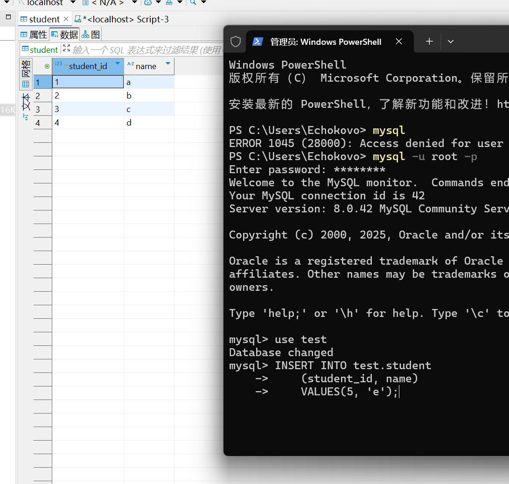
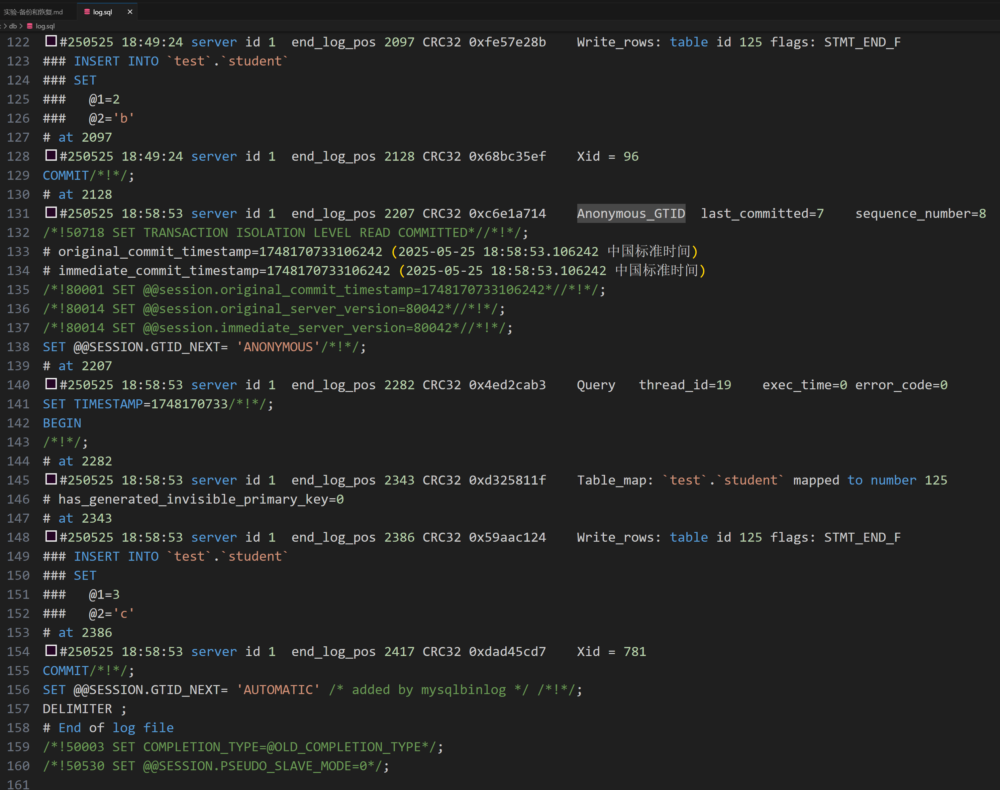
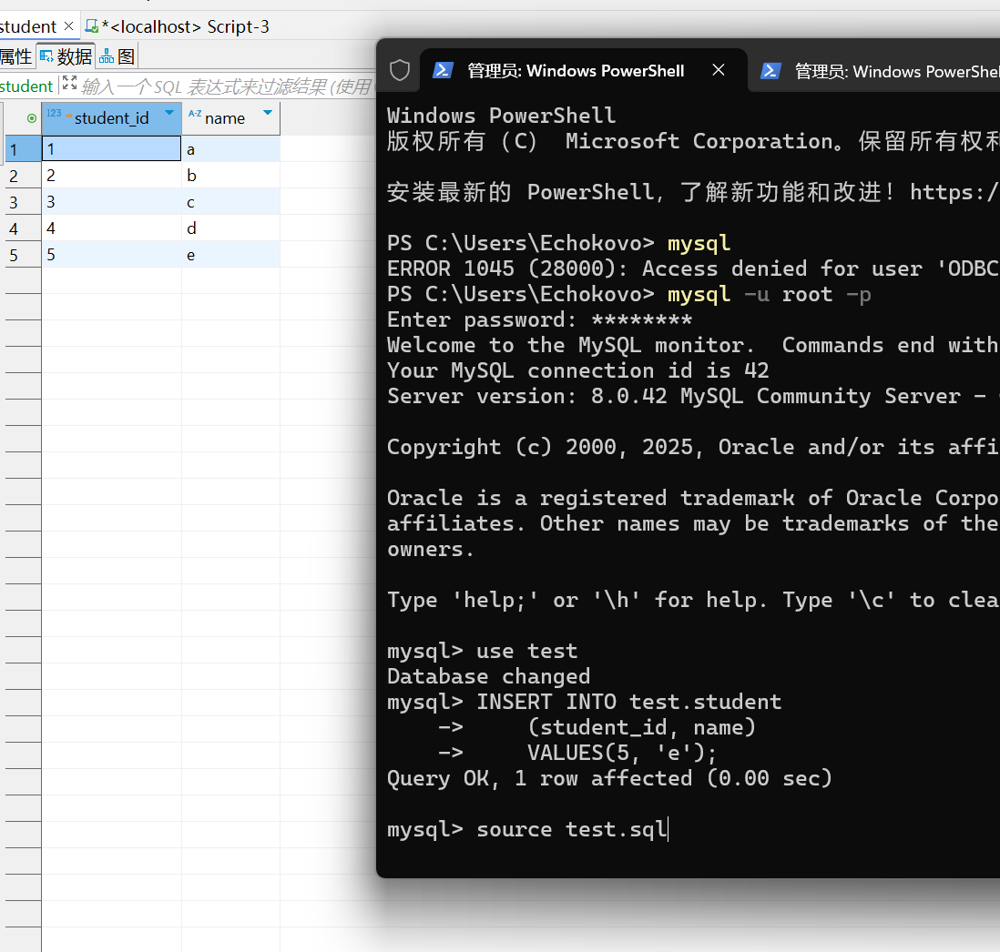
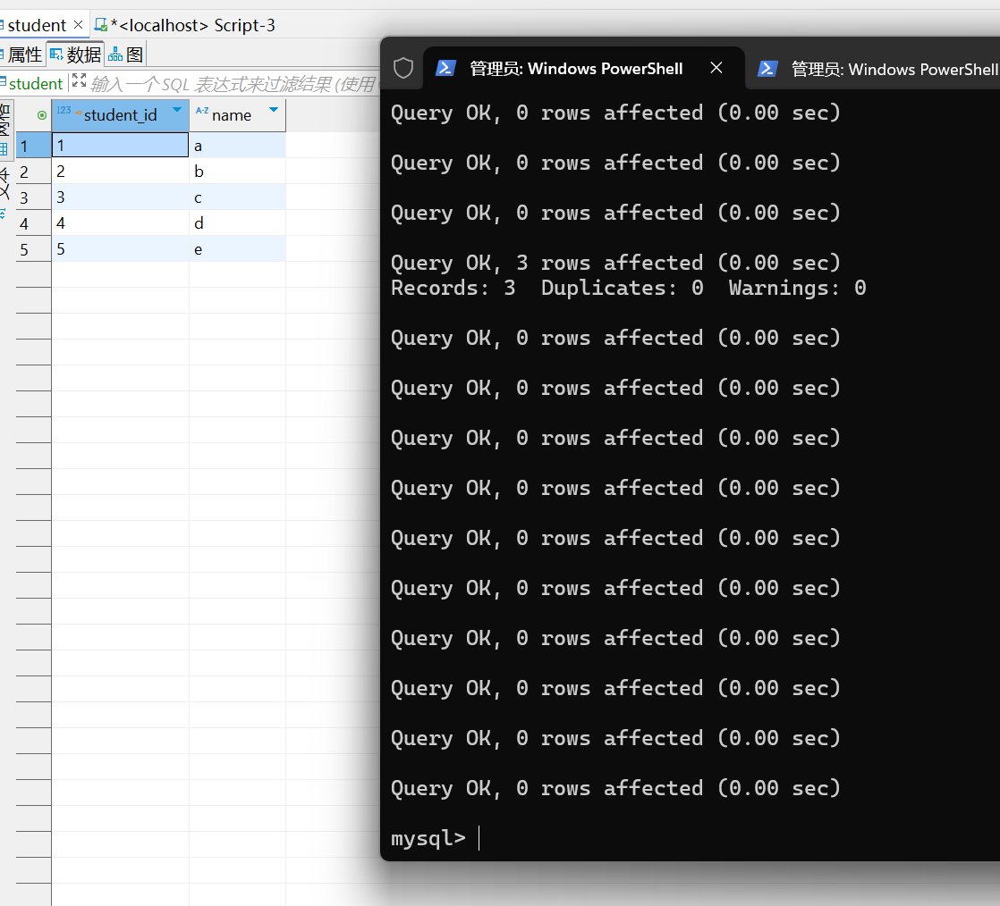

1. 创建一个备份设备
2. 完整备份实验数据库到备份设备
    ```bash
    mysqldump -u root -p test > test.sql
    ```
3. 向实验数据库中某个表插入若干条记录
    ```sql
    INSERT INTO test.student
    (student_id, name)
    VALUES(5, 'e');
    ```
    
4. 备份数据库事务日志到备份设备，并查看日志格式
    ```bash
    mysqlbinlog --no-defaults --database=test --base64-output=decode-rows -v "C:\ProgramData\MySQL\MySQL Server 8.0\Data\ECHOKOVO-bin.000002" > log.sql
    ```
    
5. 利用第 2 步所得的完整备份，恢复到插入记录前的状态
    ```sql
    source test.sql
    ```
    
    
6. 利用第 4 步所得的事务日志，恢复到插入记录后的状态 
    ```sql
    source log.sql
    ```
    