# 实验环境
- Windows 11 系统
- MySQL 9.2
- DBeaver 25.0.2
- 交互式 SQL 所用数据库
# 实验内容与完成情况
- 授权与回收
  - 在数据库中由 DBA 创建若干用户
    右键用户栏，新建用户
    
  - 对用户进行授权和回收
    - 将查询 Students 表的权限授予给用户 test_1
        选中用户 test_1，授予其对 Students 表的 SELECT 权限
        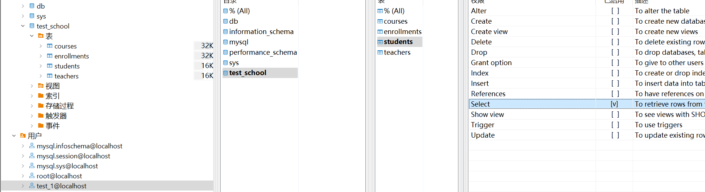
        ```sql
        GRANT SELECT ON test_school.students TO `test_1`@`localhost`
        ```
    - 将查询和修改所有表的权限授予给用户 test_2 和 test_3
        依次选中用户 test_2 和 test_3，授予其对所有表的所有权限
        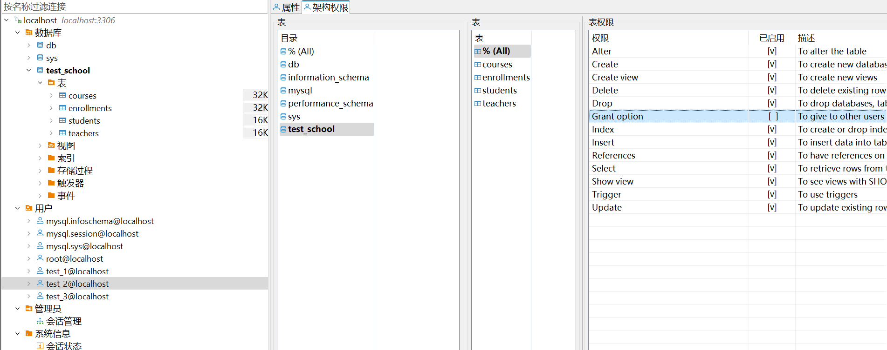
        ```sql
        GRANT ALL PRIVILEGES ON test_school.courses TO 'test_2'@'localhost';
        GRANT ALL PRIVILEGES ON test_school.enrollments TO 'test_2'@'localhost';
        GRANT ALL PRIVILEGES ON test_school.students TO 'test_2'@'localhost';
        GRANT ALL PRIVILEGES ON test_school.teachers TO 'test_2'@'localhost';

        GRANT ALL PRIVILEGES ON test_school.courses TO 'test_3'@'localhost';
        GRANT ALL PRIVILEGES ON test_school.enrollments TO 'test_3'@'localhost';
        GRANT ALL PRIVILEGES ON test_school.students TO 'test_3'@'localhost';
        GRANT ALL PRIVILEGES ON test_school.teachers TO 'test_3'@'localhost';
        ```
    - 将用户 test_2 修改 Students 表的权限收回
        选中用户 test_2，收回其对 Students 表的 Update 权限
        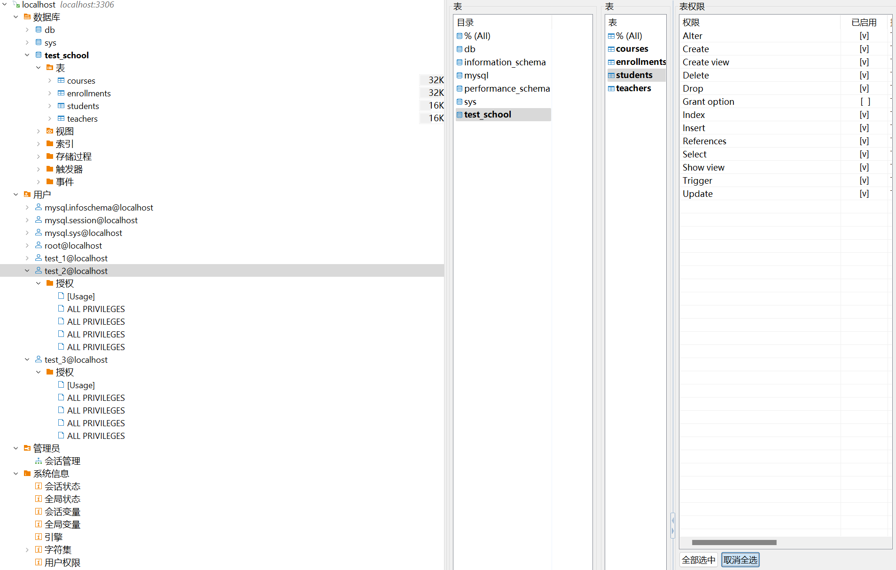
        ```sql
        REVOKE UPDATE ON test_school.students FROM 'test_2'@'localhost';
        ```
    - 将用户 test_3 所有权限收回
        ```sql
        REVOKE ALL PRIVILEGES ON test_school.courses FROM 'test_3'@'localhost';
        REVOKE ALL PRIVILEGES ON test_school.enrollments FROM 'test_3'@'localhost';
        REVOKE ALL PRIVILEGES ON test_school.students FROM 'test_3'@'localhost';
        REVOKE ALL PRIVILEGES ON test_school.teachers FROM 'test_3'@'localhost';
        ```
    - 最终效果
        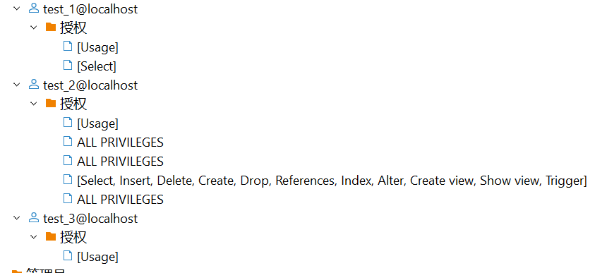
- 完整性控制
  - 实体完整性
    1. Students 表的主码为 student_id，该表中存在 3 行数据（表的创建已在交互式 SQL 实验中完成）
    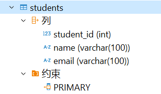
    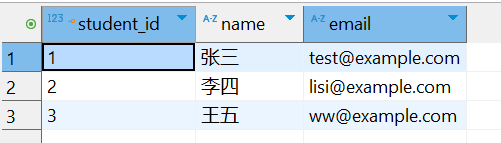
    2. 插入(2, '测试', 'test')
    ```sql
    INSERT INTO test_school.students
    (student_id, name, email)
    VALUES(2, '测试', 'test')
    ```
    3. MySQL 报错
    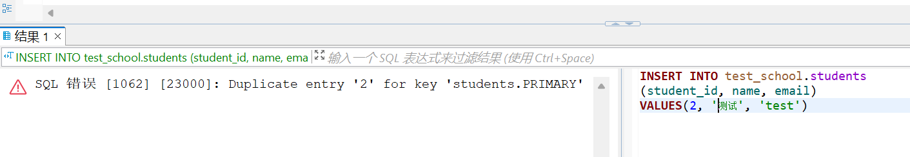
  - 参照完整性
    - 在 Enrollments（参照）表插入元组
        1. Enrollments 表参照了 Students 和 Courses 表，该表中存在 2 行数据（表的创建已在交互式 SQL 实验中完成）
        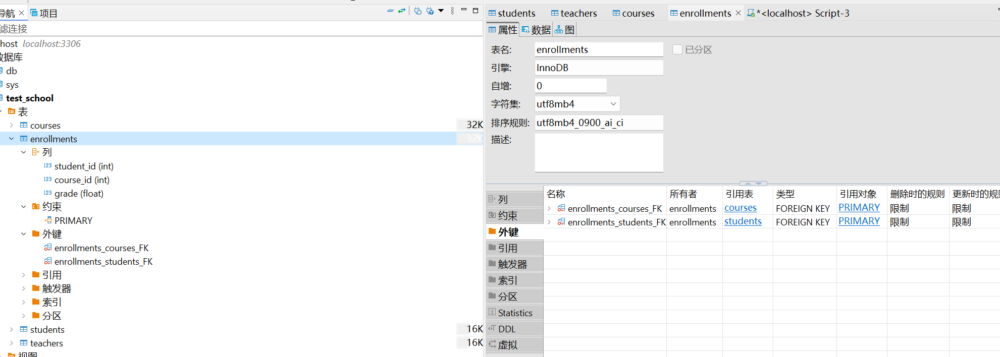
        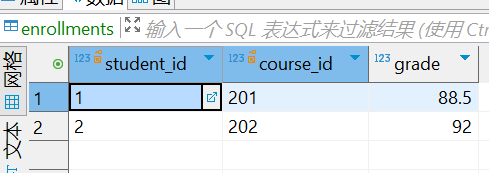
        2. 在 Enrollments 表中插入(100, 3000, 5000)
        ```sql
        INSERT INTO test_school.enrollments
        (student_id, course_id, grade)
        VALUES(100, 3000, 5000);
        ```
        3. MySQL 报错
        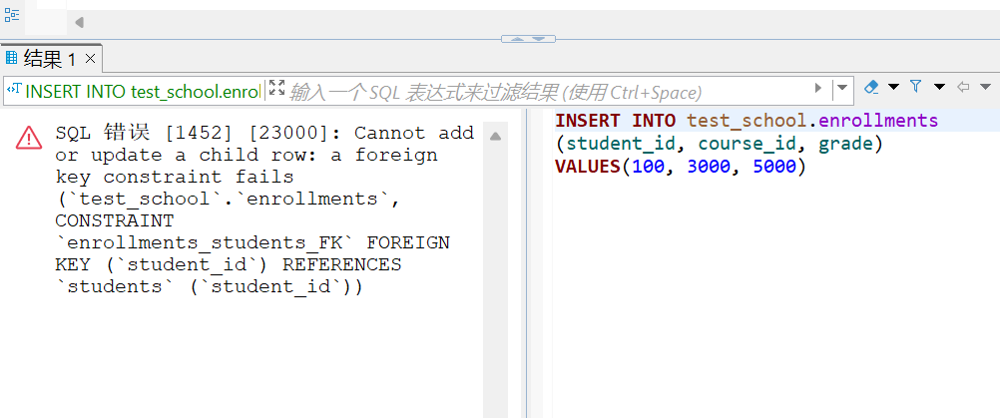
    - 在 Enrollments（参照）表修改外码值
        1. 在 Enrollments 表中修改第 1 行数据
        ```sql
        UPDATE test_school.enrollments
        SET course_id=500000
        WHERE student_id=1;
        ```
        2. MySQL 报错
        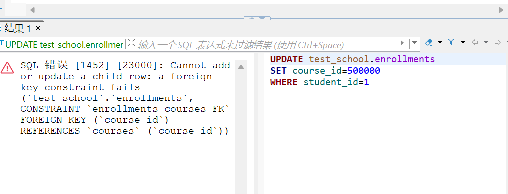
    - 在 Students（被参照）表删除元组
        1. 在 Students 表中删除被参照的第 1 行数据
        ```sql
        DELETE FROM test_school.students
        WHERE student_id=1;
        ```
        2. MySQL 报错
        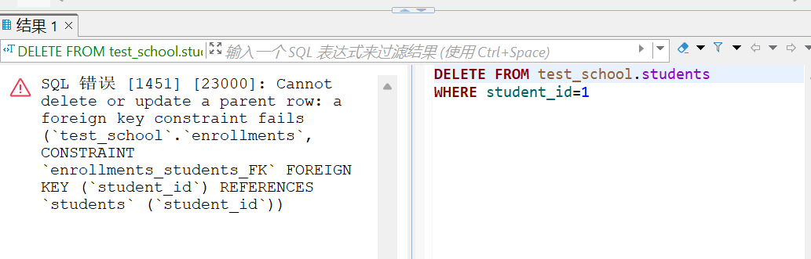
    - 在 Students（被参照）表修改主码值
        1. 在 Students 表中修改被参照的第 1 行数据
        ```sql
        UPDATE test_school.students
        SET student_id=555
        WHERE student_id=1;
        ```
        2. MySQL 报错
        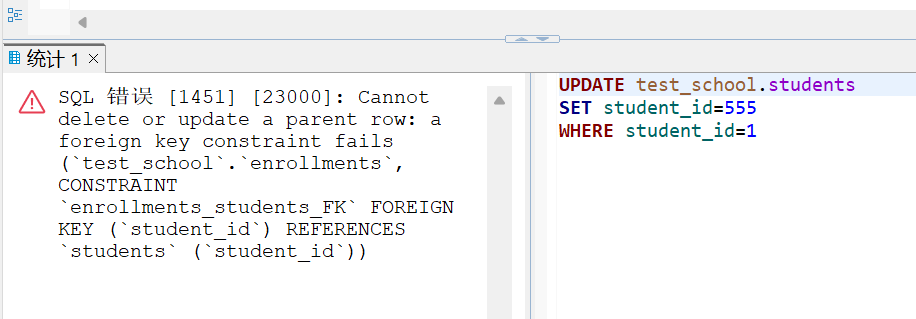
  - 用户定义完整性
    1. 设置 Enrollments 表的 grade 列的约束为 UNIQUE
    ```sql
    ALTER TABLE test_school.enrollments ADD CONSTRAINT enrollments_unique UNIQUE KEY (grade);
    ```
    2. 更改 Enrollments 表的第 1 行数据的 grade 列为 92 使其与第 2 行数据的 grade 列相同
    ```sql
    UPDATE test_school.enrollments
    SET grade=92
    WHERE student_id=1;
    ```
    3. MySQL 报错
    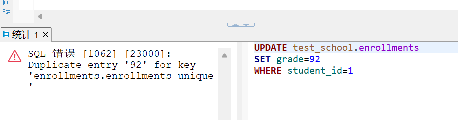
  - CHECK 短语
    1. 设置 Enrollments 表的 grade 列的约束为 0<=grade<=100
    ```sql
    ALTER TABLE test_school.enrollments ADD CONSTRAINT enrollments_check CHECK (grade <= 100 and grade >= 0);
    ```
    2. 更改 Enrollments 表的第 1 行数据的 grade 列为 5000
    ```sql
    UPDATE test_school.enrollments
    SET grade=500
    WHERE student_id=1;
    ```
    3. MySQL 报错
    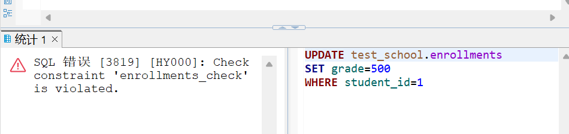
  - CONSTRAINT 子句
    1. 设置 Students 表的约束为学号小于等于 500 并且名字长度大于等于 2
    ```sql
    ALTER TABLE test_school.students ADD CONSTRAINT students_check CHECK (student_id <= 500 AND LENGTH(name) >= 2);
    ```
    2. 插入(501, 't', 'asdasd')
    ```sql
    INSERT INTO test_school.students
    (student_id, name, email)
    VALUES(501, 't', 'asdasd');
    ```
    3. MySQL 报错
    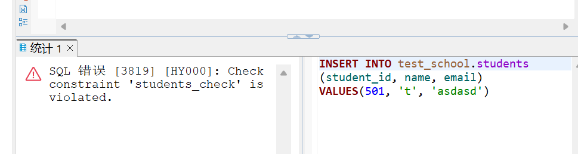
# 出现的问题及解决方案
- 无