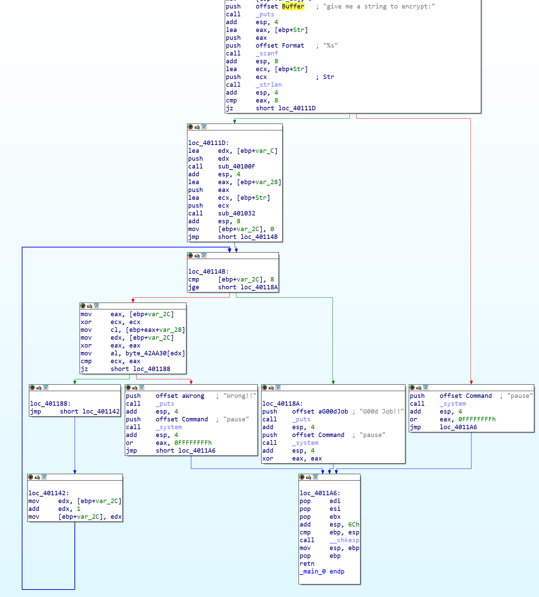
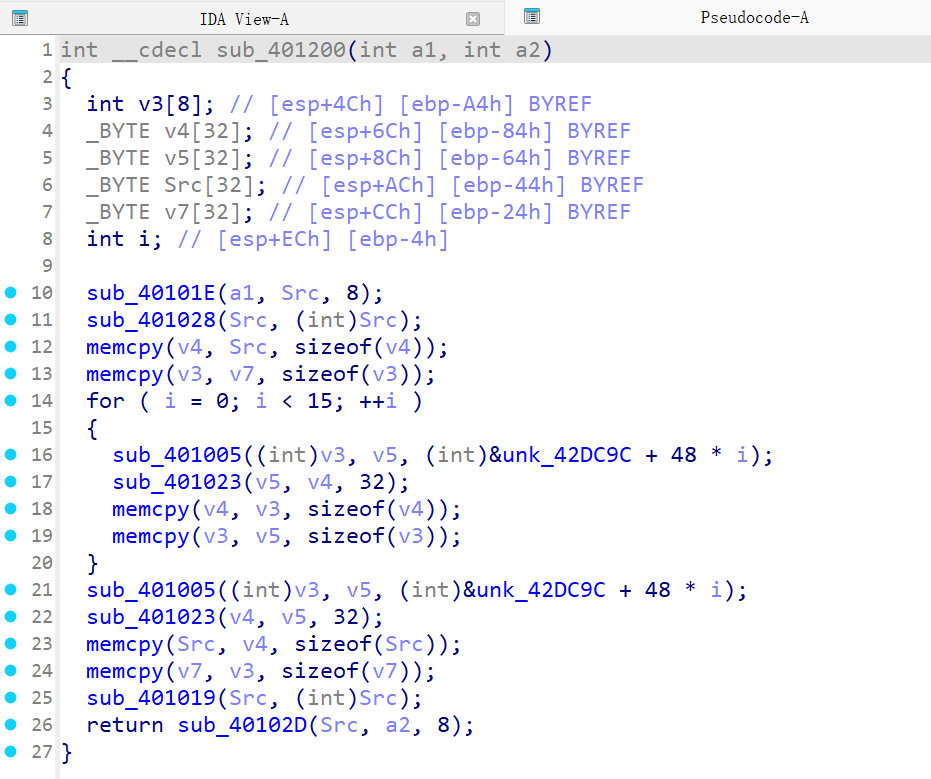
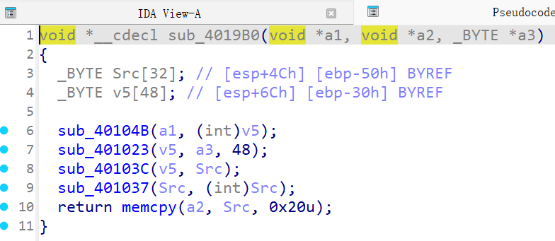
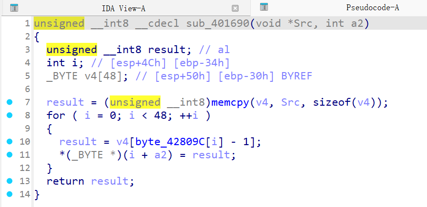
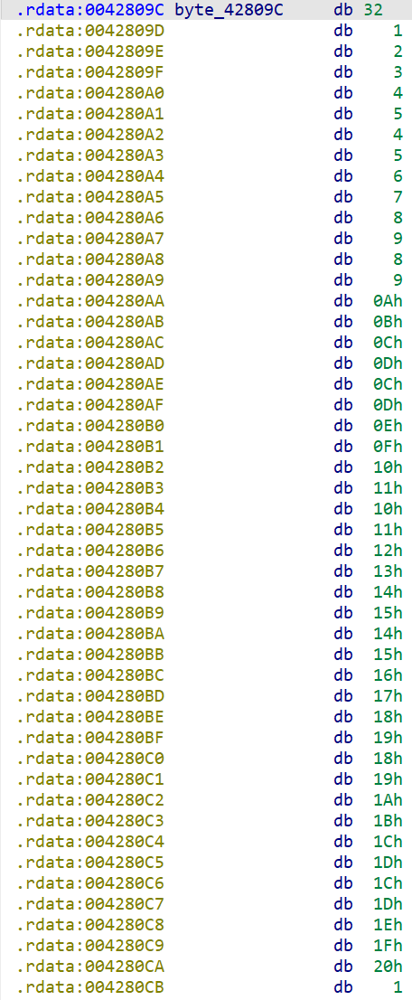
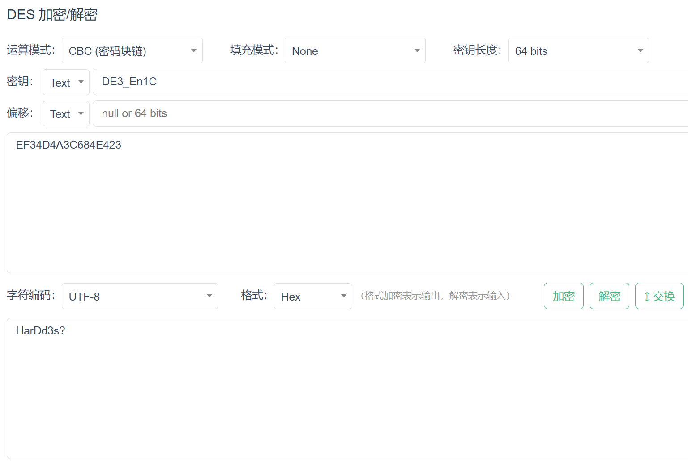
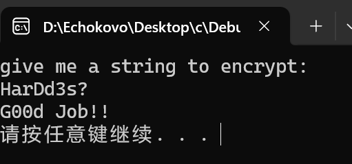

# DES算法逆向分析
#### 先直接运行程序，不难发现当输入长度为8个字符时程序会进行判定
## 使用 IDA 静态分析该程序
#### main 函数如图所示

#### 可知`var_C`被传入了函数`sub_40100F`，推测其为密钥编排函数，`DE3_En1C`为密钥
#### 输入的`str`和`var_28`被传入了函数`sub_401032`，推测其为加密函数
#### `var_2C`为 main 函数中的一个循环的控制变量 i
#### 具体分析该循环
#### 可知其功能是将`var_28`与`byte_42AA30`的各位进行比较，若全部相同才能通过
#### 推测`byte_42AA30`为目标密文，双击查看其值

#### 现进入具体的加密函数进行分析
#### 进入`sub_401032`

#### 可知加密一共有16轮
#### 多次用到memcpy函数，`v4`和`v3`疑似是用于保存加密中间结果的数组
#### 推测`unk_42DC9C`为编排后的子密钥
#### `sub_401005`疑似加密轮中的函数
#### 进入`sub_401005`

#### 进入`sub_40104B`

#### 查看`byte_42809C`

#### 发现 DES 的 E 盒
#### 故将`var_C`和`byte_42AA30`输入 DES 解密程序，得到flag

#### 将 flag 输入程序
