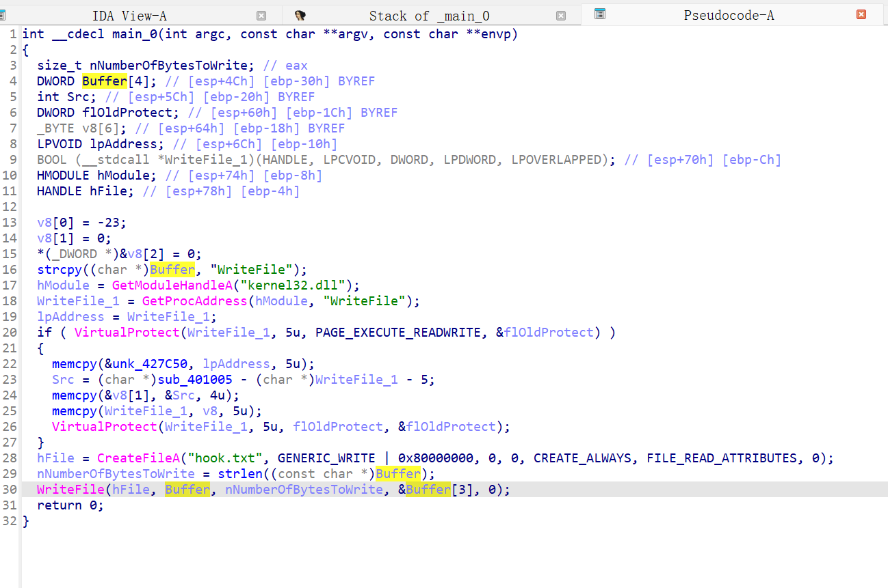
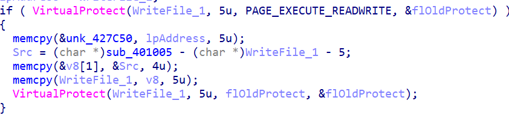
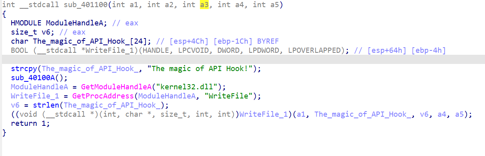
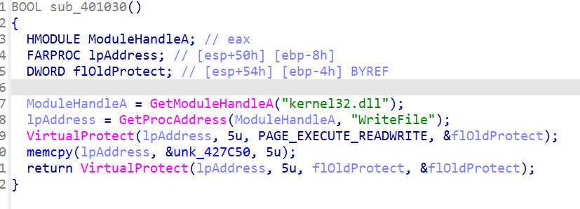

# 分析程序伪代码

### 可知程序将在执行路径新建一个文件 `hook.txt`
### 内容为变量 `Buffer` 中的 `WriteFile`
### 然而实际运行时 `hook.txt` 中的内容却为 `The magic of API Hook!`
### 程序调用了两次 `VirtualProtect` 函数修改了 `kernel32.dll` 中的 `WriteFile` 函数的前 5 个字节
# 分析两次 `VirtualProtect` 函数中的代码

### `memcpy(&unk_427C50, lpAddress, 5u)` 将 `WriteFile` 函数前 5 个字节保存至 `unk_427C50`
### `Src = (char *)sub_401005 - (char *)WriteFile_1 - 5` 计算 hook 函数与被 hook 函数的相对偏移
### `memcpy(&v8[1], &Src, 4u)` 将相对偏移地址写入 v8
### `memcpy(WriteFile_1, v8, 5u)` 将 v8 写入 `WriteFile` 函数的前 5 个字节
### 可得 v8[0] = -23 为汇编码中的 E9(JMP)
# 分析函数 `sub_401005`

### 可知该函数调用了 WriteFile 函数
### 且该函数接收了 5 个参数，与 WriteFile 函数的参数数量相同
### 可知该函数接管了 WriteFile 函数的调用
# 分析函数 `sub_40100A`

### 该函数调用了两次 `VirtualProtect` 函数修改了 `kernel32.dll` 中的 `WriteFile` 函数的前 5 个字节
### 且发现变量 `unk_427C50` 被写回 `WriteFile` 函数的前 5 个字节
### 可知该函数功能为将 `WriteFile` 函数恢复正常