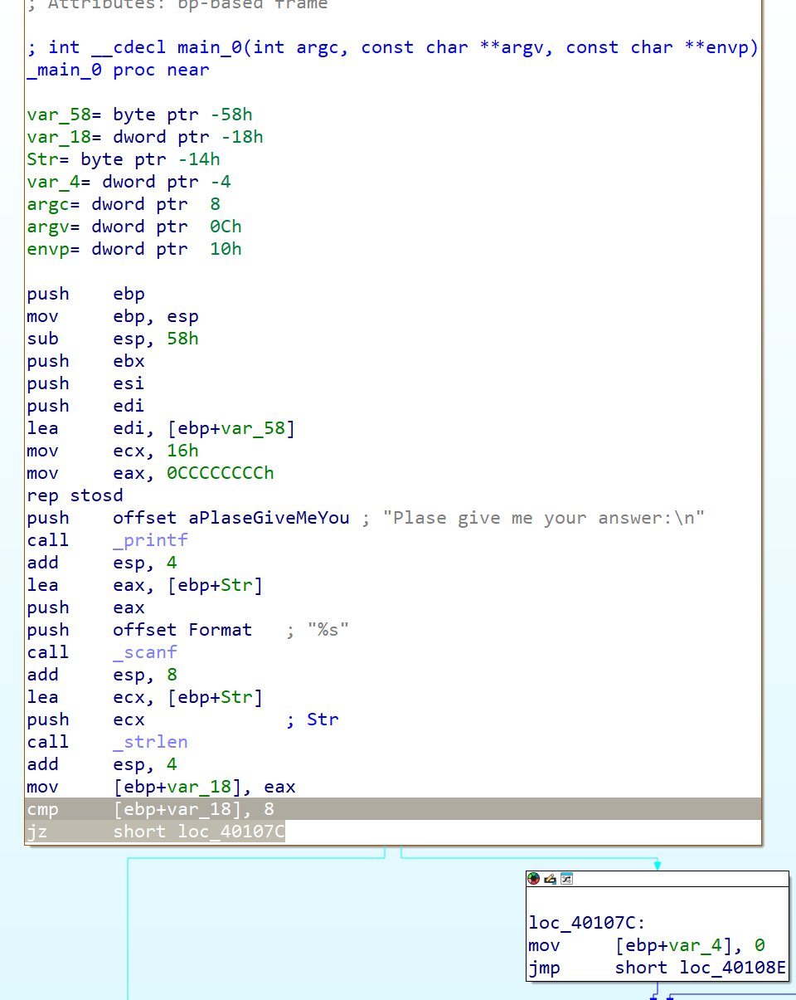
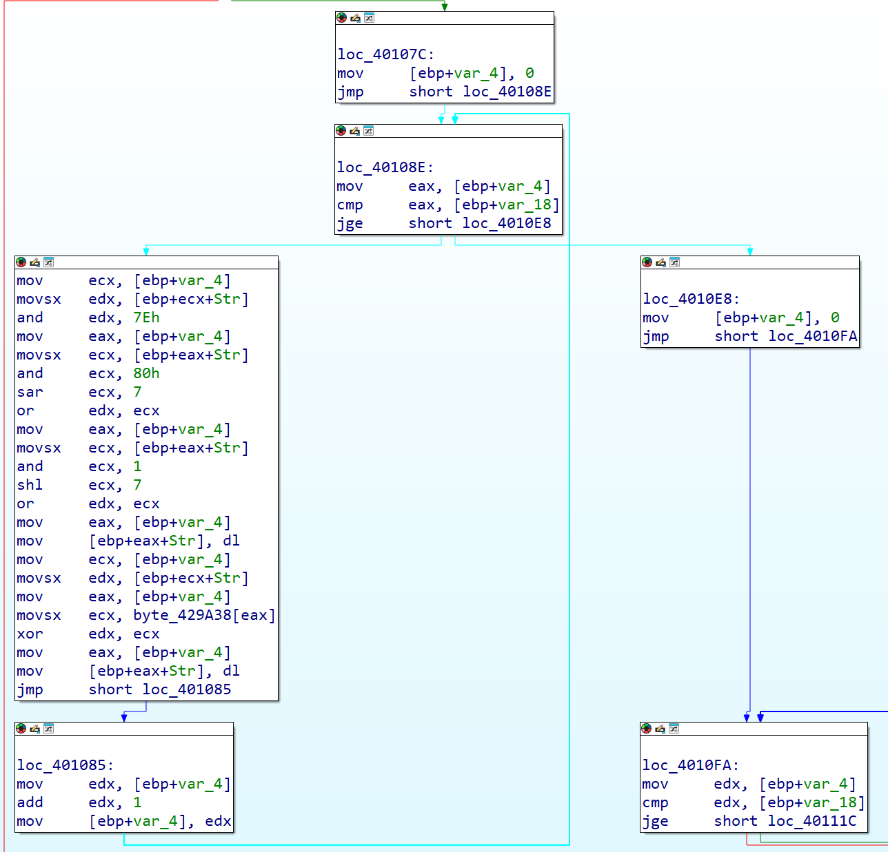
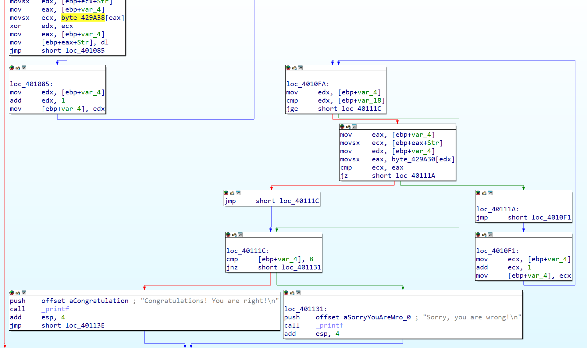
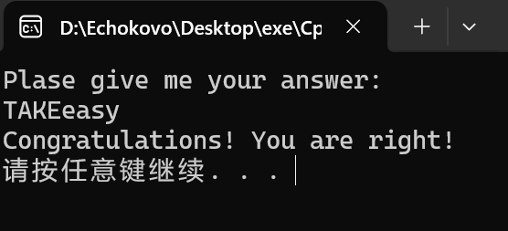

### 
### 分析程序main函数前段
### 发现需要输入长度为8的字符串，否则会直接跳转至程序结束
### 
### 往后分析，得出左边的汇编指令的结果是：
### 依次取出输入的字符串的每一位，通过与运算取出该位的第0位与第7位，再通过或运算得到结果
### 即将输入的字符串的每一位的第0位与第7位调换位置
### 再将其与 byte_429A38 中对应的值进行异或
### 双击 byte_429A38 得到其值为：
```{0x6,0x7,0x8,0x9,0xA,0xB,0xC,0xD,0,...,0}```
### 
### 分析程序后半段，发现上文操作后的字符串要与 byte_429A30 中的值进行比较
### 双击 byte_429A30 得到其值为
```{0x52,0xC7,0xC2,0xCD,0xEE,0xEB,0xFE,0xF5}```
### 编写代码
```c
# include<iostream>
int main(){
    int s[]={0x52,0xC7,0xC2,0xCD,0xEE,0xEB,0xFE,0xF5};
    int x[]={0x6,0x7,0x8,0x9,0xA,0xB,0xC,0xD};
    for(int i=0;i<8;i++)
        s[i]^=x[i];
    for(int i=0;i<8;i++){
        int b=s[i];
        int b8=b&0x80;
        int b72=b&0x7E;
        int b1=b&0x1;
        b8=b8>>7;
        b1=b1<<7;
        s[i]=b8|b72|b1;
        printf("%c",s[i]);
    }
    return 0;
}
```
### 输出flag为```TAKEeasy```
### 
### 结果正确