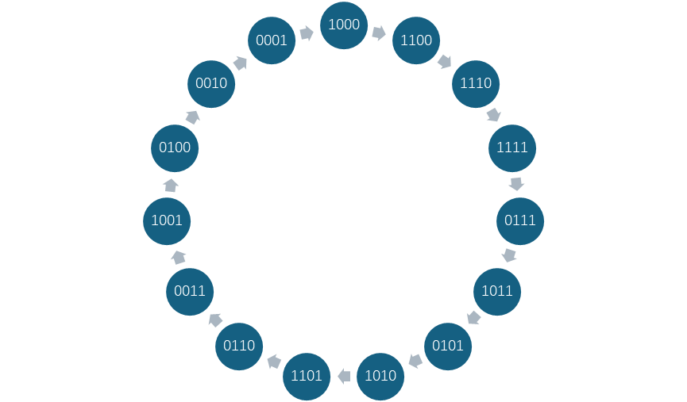
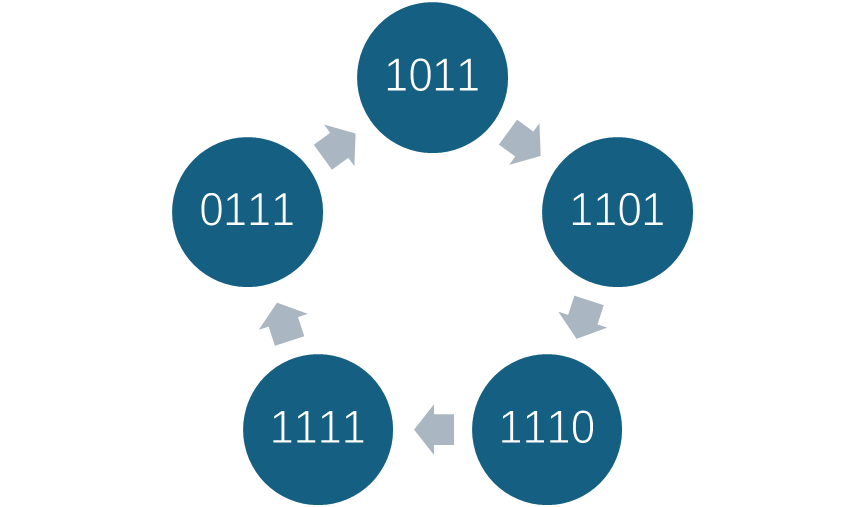

# 1.计算这个线性移位寄存器的状态转换图，并给出该移位寄存器的输出及周期。

### 输出`000111101011001`，周期为`15`
# 2.计算这个非线性移位寄存器的状态转换图，并给出此非线性移位寄存器的输出序列及周期。

### 输出`11011`，周期为`5`
# 3.试破译该密码系统。
### xxxxxxxxxx select sname from student where not exists (    select cno from course     except     select cno from sc where sno = student.sno);sql
### 已知密钥流来自 3 级线性反馈移位寄存器，建立以下方程
$$
\begin{pmatrix}
    1 & 1 & 1 \\
    1 & 1 & 0 \\
    1 & 0 & 1
\end{pmatrix}
\begin{pmatrix}
    a_3 \\
    a_2 \\
    a_1
\end{pmatrix}
=\begin{pmatrix}
    0 \\
    1 \\
    0
\end{pmatrix}
$$
### 解得$a_3a_2a_1=101$
### 即该线性反馈移位寄存器的反馈函数为$f(b_3,b_2,b_1)=b_3\oplus b_1$
# 4.构造一个输出小 m 序列的 5 级 LFSR。
### $n=5$时，查表得本原多项式为$x^5+x^2+1$
### 得到反馈函数为$f(b_5,b_4,b_3,b_2,b_1)=b_4\oplus b_1$
# 5.调研 ZUC 算法，概述其三层结构并详细说明 ZUC 算法中线性移位寄存器的特色及优势。
### 三层结构
1. 线性反馈移位寄存器（LFSR）
   - 功能：作为算法的基础，生成具有长周期和良好统计特性的伪随机序列。  
   - 结构：16级线性反馈移位寄存器，基于素域 $ GF(2^{31} - 1) $ 上的16次本原多项式设计，输出序列具有最大周期特性（周期为 $ 2^{256} - 1 $）。  
   - 输出：每轮生成31bit的字，作为后续层的输入。
2. bit重组（BR）  
   - 功能：从LFSR的128bit状态中提取数据，重组为4个32bit字（$ X_0, X_1, X_2, X_3 $），破坏LFSR的线性结构，增强混淆性。  
   - 过程：将LFSR的寄存器单元变量（如 $ s_0, s_2, s_5, \dots $）按特定规则拼接，输出供非线性函数F使用。
3. 非线性函数F  
   - 功能：通过非线性变换进一步增强密钥流的随机性和抗攻击能力。  
   - 结构：包含两个32bit记忆单元（$ R_1, R_2 $），输入为BR输出的3个32bit字（$ X_0, X_1, X_2 $），经异或、循环移位、模加运算及S盒变换，输出32bit字 $ W $。  
   - 输出：$ W $ 与 $ X_3 $ 异或后形成最终密钥流。
### 特色及优势
1. 双模式运行机制  
   - 初始化模式：接收31bit输入（由非线性函数F的输出处理而来），更新寄存器状态，用于密钥和IV的加载。  
   - 工作模式：无外部输入，仅通过内部反馈更新寄存器，持续生成密钥流。  
   - 作用：两种模式的切换增加了攻击者预测内部状态的难度。
2. 31bit字的特殊设计
   - LFSR的每个寄存器单元存储31bit字，而非传统的8/16/32bit。  
   - 通过素域运算增强线性复杂度，使得传统线性攻击（如Berlekamp-Massey算法）难以适用。  
   - 与后续非线性层的32bit操作兼容，通过异或等操作实现高效的数据重组。
3. 抗线性攻击能力  
   - LFSR的线性输出通过BR和F层的非线性变换（如S盒、循环移位）进一步混淆，使得算法整体抵抗线性分析和代数攻击。