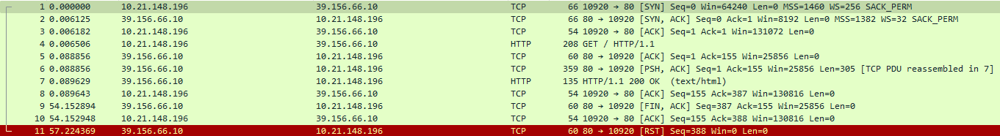
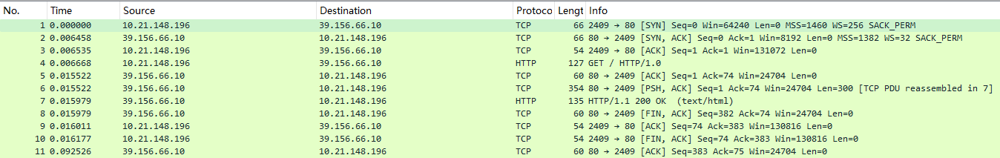
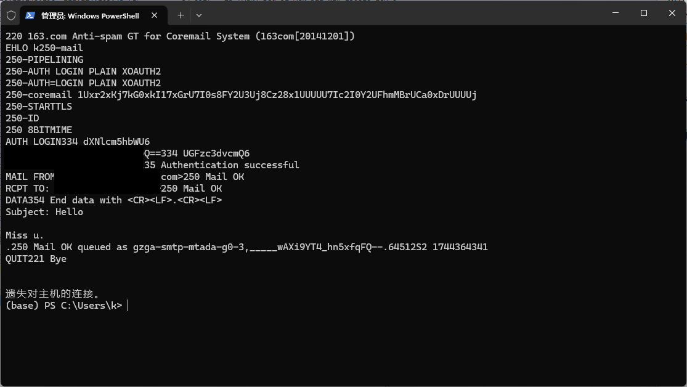
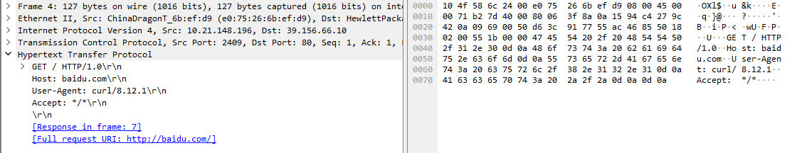
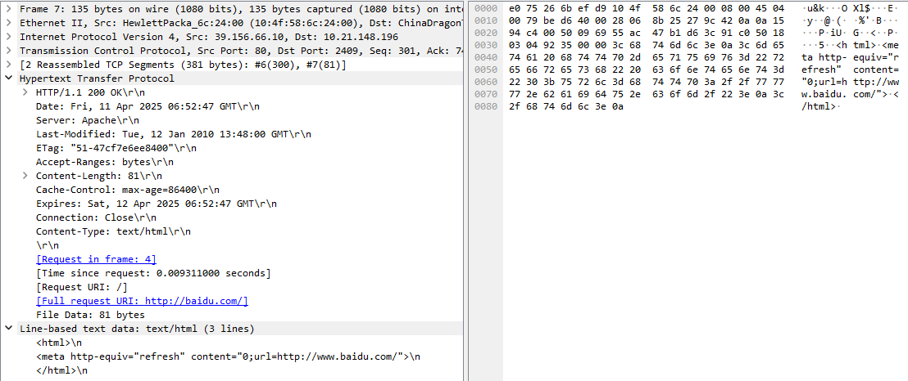
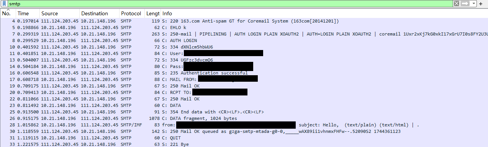

# 实验内容和实验步骤描述
## 实验任务
##### 深入理解典型的应用层协议——HTTP和SMTP的要点。
## 实验内容
##### 1. 使用Wireshark软件捕获HTTP消息，分析其消息头，理解HTTP的通信原理；
##### 2. 使用Wireshark软件捕获一次从客户端发送Email的过程，分析SMTP消息，理解Email系统中发送邮件的通信原理；
##### 3. 使用Telnet软件访问Email服务器，输入SMTP命令与Email服务器交互，理解SMTP的通信过程和Base64编码的概念。
## 实验环境
##### 一台装有MS Windows系列操作系统、Linux或Mac操作系统的计算机，能够连接到因特网，并安装Wireshark软件。
## 实验步骤
##### 安装Wireshark并运行
##### 设置过滤器为`tcp port 80`，开始捕捉，在浏览器中输入`www.xinhuanet.com`
##### 发现有两台服务器响应，一台有完整tcp三次握手，另一台直接进行http传输，可能是使用了cdn，故尝试使用curl访问其他网站以获得更加易于分析的响应
##### 在powershell中输入`curl baidu.com`，查看捕捉结果，设置过滤器为`ip.addr == 39.156.66.10`，获得了完整的tcp三次握手与http协议响应，但未得到完整的四次挥手
##### 
##### 由于http1.1协议默认使用Keep-Alive，故使用`curl --http1.0 baidu.com`再次捕获，成功得到完整的tcp与http协议响应
##### 
##### 安装Foxmail，生成邮箱授权码，使用qq邮箱进行发送邮件，出现错误`S: 530 Login fail. A secure connection is requiered(such as ssl). More information at https://help.mail.qq.com/detail/0/1010`
##### 故更换使用163邮箱，成功发送并捕获
##### 
##### 将捕获的请求保存在临时的文件中，在powershell中输入`telnet smtp.163.com 25`，将对应请求依次输入
##### 
# HTTP协议分析
## 根据捕获到的消息，对照讲义和教材，理解HTTP的功能和通信过程。
## 观察HTTP请求/应答消息的各字段及消息头的内容，自己查找资料理解各消息头的功能，列表总结请求消息和应答消息中各字段及各消息头的功能及现有值的含义。
### 请求
##### 可知GET请求访问`baidu.com/`使用http1.0协议，用户客户端为curl，接受所有语言的回复，未使用Keep-Alive
##### 
### 响应
##### 可知响应使用http1.1协议，状态码200 OK，日期Date，服务器应用程序软件的名称和版本Server为Apache，该页上次修改时间Last-Modified，缓存标识符ETag，对文件下载请求的支持范围Accept-Ranges，消息体的大小Content-Length为81字节，缓存控制指令Cache-Control缓存存储的最大周期为86400s，响应过期时间Expires，连接类型Connection为close即非持久连接，响应资源类型Cootent-Type为text/html
##### 响应的html字段为
```html
<html>\n
<meta http-equiv="refresh" content="0;url=http://www.baidu.com/">\n
</html>\n
```
##### 功能为让浏览器刷新页面，将该网页重新导向至`www.baidu.com`
##### 
# SMTP协议分析
## 根据捕获到的消息，对照讲义和教材，理解SMTP的功能和通信过程。
## 观察SMTP命令消息和响应状态码，自己查资料理解命令和状态码的功能，并画出一次完整通信过程所对应的消息序列图。
##### 设置过滤器为`smtp`
##### 
##### 220为服务就绪，EHLO为成功建立连接后的固定回复，250为采取并完成了请求的操作
##### AUTH LOGIN为申请进行身份认证，334为等待用户输入验证信息
##### User与Pass后均为base64编码后的账号名称与密码（此处为授权码），235为身份验证成功
##### MAIL FROM与RCPT TO为发送者与接收者的邮箱地址
##### DATA为开始发送邮件内容，354为服务器已开始等待邮件内容输入
##### QUIT为关闭会话，221为服务关闭
### 消息序列图
```
客户端 (Client)                          服务器 (Server)
       |                                      |
       |---------- 1. 建立TCP连接 ------------>|
       |                                      |
       |<------- 2. 返回欢迎消息 (220) --------|
       |                                      |
       |---------- 3. 发送 HELO/EHLO --------->|
       |                                      |
       |<------- 4. 确认 HELO/EHLO (250) ------|
       |                                      |
       |---------- 5. 发送 MAIL FROM --------->|
       |                                      |
       |<------- 6. 确认 MAIL FROM (250) ------|
       |                                      |
       |---------- 7. 发送 RCPT TO ----------->|
       |                                      |
       |<------- 8. 确认 RCPT TO (250) --------|
       |                                      |
       |---------- 9. 发送 DATA -------------->|
       |                                      |
       |<------- 10. 准备接收数据 (354) -------|
       |                                      |
       |---------- 11. 发送邮件内容 ---------->|
       |                                      |
       |---------- 12. 发送结束标志 (. ) ----->|
       |                                      |
       |<------- 13. 确认邮件发送 (250) -------|
       |                                      |
       |---------- 14. 发送 QUIT ------------->|
       |                                      |
       |<------- 15. 确认断开连接 (221) -------|
       |                                      |
       |---------- 16. 关闭TCP连接 ----------->|
```
# 实验结论和实验心得
##### 要善用搜索引擎